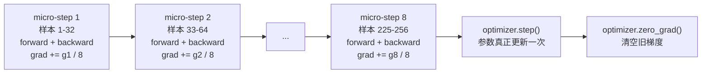
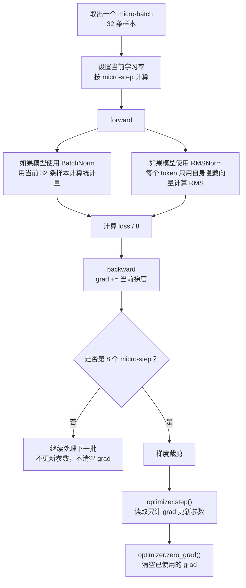

# MiniMind 预训练里的梯度累积与 SkipBatchSampler

> 本次补充：尾部不足累积窗口时为什么仍除以 `K`、checkpoint 的真实恢复边界、“墙钟时间”和四类非完全等价来源，以及“中断在一个 micro-batch 中途”时 `SkipBatchSampler` 到底会不会跳过数据。

本文只解释 MiniMind 个人复现仓库中的预训练链路，重点回答两个问题：

1. 为什么预训练默认设置了 `accumulation_steps=8`。
2. `SkipBatchSampler` 到底跳过了什么，它在恢复训练里起什么作用。

事实边界先说清楚：

- 当前本地代码事实：本仓库 `trainer/train_pretrain.py`、`trainer/trainer_utils.py`、`dataset/lm_dataset.py` 与本机上游引用仓库对应文件逐字一致，本轮用 `cmp` 检查结果为 0。
- 上游引用事实：本机上游引用仓库位于 `../../../references/minimind`，当前提交为 `512eed0b6556e741d80864f054d45d271459772a`。
- 本机已验证事实：已有极小 CPU 单 batch 实验验证过 `JSONL -> tokenizer -> Dataset -> DataLoader -> forward -> loss -> backward -> optimizer.step -> checkpoint/resume` 最短闭环，见 [实验记录](experiment-tiny-pretrain-one-batch-2026-07-04.md)。该实验没有验证正式 `train_pretrain.py` 的 AMP、DDP、梯度累积和长时间 GPU 训练。
- 工程判断：梯度累积主要服务显存受限场景下的有效 batch 放大；`SkipBatchSampler` 主要服务断点续训时的数据进度对齐。它们都不是提升模型智商的魔法按钮，而是训练工程里的秩序维护工具。

## 先把训练循环里的几个动词说成人话

如果不熟训练代码，先不要急着看 `accumulation_steps`。MiniMind 预训练每一小批数据进来时，核心动作可以翻译成下面这张表：

| 代码动作 | 人话解释 | 发生在 MiniMind 哪里 |
| --- | --- | --- |
| `forward` | 把一批 `input_ids` 喂给模型，让模型根据当前参数猜“下一个 token 是谁”，输出每个位置对整个词表的打分 `logits`。 | [train_pretrain.py](../trainer/train_pretrain.py#L36)、[model_minimind.py](../model/model_minimind.py#L245) |
| 算 `loss` | 把模型的猜测和正确答案 `labels` 对比，得到一个“错得有多离谱”的数字。数字越小，说明当前这批数据上猜得越接近。 | [model_minimind.py](../model/model_minimind.py#L251) |
| `loss.backward()` | 根据这个错误数字，反推出每个参数应该往哪个方向改。它只是把“修改建议”写到每个参数的 `.grad` 里，还没有真正改参数。 | [train_pretrain.py](../trainer/train_pretrain.py#L40) |
| `optimizer.step()` | 优化器读取 `.grad` 里的修改建议，真正改变模型参数。 | [train_pretrain.py](../trainer/train_pretrain.py#L46) |
| `optimizer.zero_grad()` | 清空刚才用过的修改建议，避免下一轮训练把旧建议和新建议混在一起。 | [train_pretrain.py](../trainer/train_pretrain.py#L49) |

可以把一次普通训练想成“做题、批改、改答案、擦掉草稿”。`forward` 是做题，`loss` 是批改分数，`backward` 是写出哪里该改，`optimizer.step()` 是真的改答案，`optimizer.zero_grad()` 是把这次批改意见从草稿纸上擦掉。梯度累积的特殊点在于：MiniMind 不是每次批改后都立刻改答案，而是先攒 8 次批改意见，再统一改一次。

显存也先用人话理解：显存不是“模型聪明程度”，而是 GPU 上临时放东西的工作台。训练时显存里不只放模型参数，还会放这一批样本的 token、每一层中间结果、attention 计算的临时矩阵、loss 反向传播需要的计算图、每个参数的梯度、优化器状态等。`batch_size` 越大、序列越长、层数越多，这张工作台上同时要摆的东西越多。工作台摆不下，就会出现 CUDA out of memory，也就是常说的 OOM。梯度累积的思路不是让工作台变大，而是把一次大活拆成几次小活：每次只摆一小批，摆得下；连续做几小批后，再汇总梯度更新参数。

## 可直接口述回答（>=1000字）

MiniMind 预训练默认设置梯度累积，最直接的原因是：它想在单次显存只能装下较小 micro-batch 的情况下，模拟一个更大的有效 batch。预训练入口里默认 `batch_size=32`，`accumulation_steps=8`，位置分别在 [train_pretrain.py](../trainer/train_pretrain.py#L88) 和 [train_pretrain.py](../trainer/train_pretrain.py#L93)。这里的 `batch_size` 不是最终每次参数更新看到的全部样本数，而是每次塞进模型的一小批样本数。训练循环在 [train_pretrain.py](../trainer/train_pretrain.py#L35) 到 [train_pretrain.py](../trainer/train_pretrain.py#L40) 做的是：先把这一批 token 喂给模型，让模型猜下一个 token，这叫 forward；再把猜测和答案对比，得到 loss；接着把 loss 除以 `args.accumulation_steps`；最后执行 backward，把“这批数据建议参数怎么改”累积到 `.grad` 里。只有当 `step % args.accumulation_steps == 0` 时，才会在 [train_pretrain.py](../trainer/train_pretrain.py#L42) 到 [train_pretrain.py](../trainer/train_pretrain.py#L49) 做梯度裁剪、`optimizer.step()` 和 `optimizer.zero_grad()`。也就是说，`backward` 像写修改建议，`optimizer.step()` 才是真的修改模型参数，`optimizer.zero_grad()` 是把已经用过的建议清掉，避免下一轮把旧建议也算进去。

可以把这个过程想成“分 8 次搬砖，再一起砌墙”。如果显存是一辆小推车，一次只能装 32 条样本的激活、梯度和临时张量，那就不要硬把 256 条样本一次塞进去。MiniMind 的做法是：每次推 32 条样本进模型，得到一份梯度，不马上更新参数，而是先把梯度存在参数的 `.grad` 里；连续推 8 次以后，再让 AdamW 根据累积起来的梯度更新一次模型参数。单进程下，有效 batch 近似是：

$$
B_{\text{effective}} = B_{\text{micro}} \times K
$$

其中 $B_{\text{micro}}$ 是 `batch_size`，$K$ 是 `accumulation_steps`。按默认值就是：

$$
B_{\text{effective}} = 32 \times 8 = 256
$$

如果考虑序列长度，上游默认 `max_seq_len=340`，那么单进程一次 optimizer update 大约覆盖：

$$
T_{\text{effective}} = B_{\text{micro}} \times K \times L = 32 \times 8 \times 340 = 87040
$$

个 token 位置。这里 $L$ 是序列长度。若启用 DDP，也就是 `DistributedDataParallel`，中文可以理解成“分布式数据并行训练”，有效 batch 还要乘以 `world_size`：

$$
B_{\text{effective}} = B_{\text{micro}} \times K \times W
$$

其中 $W$ 是 GPU 训练进程数。比如有 2 张 GPU，每张 GPU 各有一个训练进程，每个进程都处理自己的 batch，反向传播后再同步梯度，那么 $W=2$。本机当前主要关注单机小显存学习场景，不要把 DDP 写成已经验证过的多卡训练成果。

为什么 loss 要除以 `accumulation_steps`？这里要抓住一个 PyTorch 习惯：`loss.backward()` 默认不是“覆盖旧梯度”，而是“把新梯度加到旧梯度上”。这就是为什么普通训练每次 `optimizer.step()` 之后都要 `optimizer.zero_grad()`。如果不清空，下一批数据的梯度会继续加在上一批的 `.grad` 上，优化器以为这些梯度都属于当前要更新的一次决策。梯度累积正是故意利用这个“会相加”的机制：前 7 次不清空，让梯度攒起来；第 8 次更新完才清空。问题在于，既然要把 8 批数据当作一个大 batch，我们通常想取“8 批的平均意见”，不是“8 批意见直接叠成 8 倍音量”。所以每一批的 loss 先除以 8，再 backward。源码里 [train_pretrain.py](../trainer/train_pretrain.py#L37) 先取 `res.loss + res.aux_loss`，再在 [train_pretrain.py](../trainer/train_pretrain.py#L38) 除以累积步数。公式可以写成：

$$
L_i = L_{\text{CE},i} + L_{\text{aux},i}
$$

$$
L_{\text{backward},i} = \frac{L_i}{K}
$$

连续 $K$ 个 micro-batch 的累积梯度是：

$$
g = \sum_{i=1}^{K} \nabla_\theta \left(\frac{L_i}{K}\right)
  = \frac{1}{K}\sum_{i=1}^{K}\nabla_\theta L_i
$$

这就近似等价于对 $K$ 个 micro-batch 的平均 loss 做一次反向传播。直观说，8 份作业分别批改，最后取平均意见再改模型，而不是让第 8 份意见独断专行，也不是把 8 份意见暴力叠成 8 倍音量。

`SkipBatchSampler` 解决的是另一个问题：断点续训时，模型、优化器和 scaler 状态恢复了，数据进度也要恢复。它的实现位于 [trainer_utils.py](../trainer/trainer_utils.py#L134)。训练入口在每个 epoch 内先准备样本索引：DDP 模式用 `DistributedSampler`，普通单进程用 `torch.randperm(len(train_ds)).tolist()`，对应 [train_pretrain.py](../trainer/train_pretrain.py#L136) 和 [train_pretrain.py](../trainer/train_pretrain.py#L159)。然后它计算：

```python
skip = start_step if (epoch == start_epoch and start_step > 0) else 0
batch_sampler = SkipBatchSampler(train_sampler or indices, args.batch_size, skip)
```

这两行在 [train_pretrain.py](../trainer/train_pretrain.py#L160) 和 [train_pretrain.py](../trainer/train_pretrain.py#L161)。如果 checkpoint 里记录 `step=200`，恢复训练时就让 sampler 丢掉本 epoch 前 200 个已经训练过的 batch，从第 201 个 batch 继续交给 DataLoader。它跳过的是 batch，不是 token，也不是单条样本，更不是 optimizer update 次数。

比喻一下，训练像读一本很厚的题册。checkpoint 里保存了你当前写到第几页、笔的墨水状态、老师批改风格，也就是模型参数、optimizer 状态、scaler 状态、epoch 和 step；`SkipBatchSampler` 像书签，它告诉 DataLoader：“前面这些页上次已经做过了，别又从第一页开始。”如果没有它，恢复训练虽然加载了模型参数，但数据会从 epoch 开头再喂一遍，等于同一批样本被重复训练；如果跳过太多，又会漏掉还没训练过的样本。两者都会让训练轨迹和原本连续训练不一致。

它的核心逻辑很简单：[trainer_utils.py](../trainer/trainer_utils.py#L143) 逐个遍历样本下标，把下标塞进 `batch`；[trainer_utils.py](../trainer/trainer_utils.py#L145) 凑够 `batch_size` 后，如果当前跳过数量还小于 `skip_batches`，就丢弃这个 batch；否则 `yield batch` 交给 DataLoader。最后如果还有不满一个 batch 的尾巴，并且已经完成跳过，也会在 [trainer_utils.py](../trainer/trainer_utils.py#L152) 到 [trainer_utils.py](../trainer/trainer_utils.py#L153) 交出去。

把它和梯度累积放在一起看，关系是这样的：`SkipBatchSampler` 决定“这次训练从哪些样本下标组成的 micro-batch 开始”；梯度累积决定“几个 micro-batch 后才真正更新一次参数”。前者管数据进度，后者管更新节奏。它们共同服务预训练主链路：

```text
JSONL text
-> tokenizer
-> PretrainDataset 生成 input_ids / labels
-> SkipBatchSampler 组织和跳过 batch 下标
-> DataLoader 取出 micro-batch
-> MiniMindForCausalLM.forward 计算 logits 和 loss
-> loss / accumulation_steps
-> backward 累积梯度
-> 每 K 个 step 做 optimizer.step
-> 保存普通权重和 resume checkpoint
```

在 RTX 5060 Laptop 约 8GB 显存上，这两个设计尤其现实。8GB 显存不像大显存训练卡那样可以随便提高 batch 和序列长度。梯度累积让我们先用更小的 `batch_size` 和 `max_seq_len` 跑通，再通过 `accumulation_steps` 调整有效 batch；`SkipBatchSampler` 则让长时间训练被中断后不至于从头浪费计算。但截至当前文档，本仓库只验证过 CPU 极小单 batch 闭环，没有验证正式默认配置在这张 GPU 上能稳定跑。因此能保守写进 README 或面试材料的是：“我阅读并同步了 MiniMind 预训练中梯度累积和断点跳 batch 的源码，理解它们分别解决显存和续训进度问题，并完成过极小训练闭环验证。”不能写成“已经完成默认配置预训练”或“验证了默认梯度累积在 8GB GPU 上稳定收敛”。

## 详细原理讲解（>=3000字，含公式）

### 1. 先从预训练到底在做什么说起

MiniMind 的预训练，本质上是在做因果语言模型训练。给模型一串 token，让它在每个位置预测下一个 token。比如一句话被 tokenizer 变成：

```text
[BOS, 今, 天, 天, 气, 好, EOS, PAD, PAD, ...]
```

`PretrainDataset` 的行为位于 [lm_dataset.py](../dataset/lm_dataset.py#L37)。它读取 JSONL 的 `text` 字段，在 [lm_dataset.py](../dataset/lm_dataset.py#L49) 用 tokenizer 编码文本，在 [lm_dataset.py](../dataset/lm_dataset.py#L50) 手工加 BOS 和 EOS，在 [lm_dataset.py](../dataset/lm_dataset.py#L51) padding 到固定长度。然后它复制一份 `input_ids` 作为 `labels`，并在 [lm_dataset.py](../dataset/lm_dataset.py#L54) 把 PAD 位置的 label 改成 `-100`。这一步的意思不是“PAD 从输入里消失了”，而是“PAD 对应的位置不参与 cross entropy loss”。

模型 forward 的 loss 计算在 [model_minimind.py](../model/model_minimind.py#L245)。当 `labels` 不为空时，[model_minimind.py](../model/model_minimind.py#L251) 做了一次 shift：

```python
x, y = logits[..., :-1, :].contiguous(), labels[..., 1:].contiguous()
```

也就是用第 $t$ 个位置的输出预测第 $t+1$ 个 token。公式写成：

$$
x_{b,t,:} = \text{logits}_{b,t,:}
$$

$$
y_{b,t} = \text{labels}_{b,t+1}
$$

其中 $b$ 表示 batch 中第几个样本，$t$ 表示序列位置，冒号 `:` 表示词表维度上的全部 logits。`logits` 的 shape 是：

```text
[batch_size, seq_len, vocab_size]
```

`labels` 的 shape 是：

```text
[batch_size, seq_len]
```

shift 后：

```text
x.shape = [batch_size, seq_len - 1, vocab_size]
y.shape = [batch_size, seq_len - 1]
```

交叉熵可以写成：

$$
L_{\text{CE}} =
-\frac{1}{N}
\sum_{(b,t)\in \Omega}
\log
\frac{\exp(x_{b,t,y_{b,t}})}
{\sum_{v=1}^{V}\exp(x_{b,t,v})}
$$

这里 $V$ 是词表大小，$\Omega$ 是所有没有被 `ignore_index=-100` 忽略的位置集合，$N=|\Omega|$ 是有效预测位置数量。直观理解：模型在每个位置给词表里每个 token 打分，正确答案那个 token 的概率越高，loss 越低；PAD 位置被 `-100` 排除，不进入平均。

从训练循环看，MiniMind 的链路是：

```text
input_ids, labels
-> model(input_ids, labels=labels)
-> res.loss + res.aux_loss
-> loss / accumulation_steps
-> backward
-> 若到累积边界则 clip + optimizer.step + zero_grad
```

这条链路的关键不是“跑了多少个 for 循环”，而是“什么时候只累积梯度，什么时候真正改参数”。

### 2. 把 forward、loss、backward、step、zero_grad 拆开讲

先看一句 MiniMind 训练代码：

```python
res = model(input_ids, labels=labels)
```

这句就是 forward。它不是一个神秘动作，只是调用模型的 `forward` 函数。`input_ids` 是一批 token id，shape 大概是：

```text
[batch_size, seq_len]
```

如果 `batch_size=32`、`seq_len=340`，那就是 32 行、每行 340 个 token id。模型拿到这些数字后，会经过 embedding、Transformer block、RMSNorm、`lm_head`，最后输出 `logits`。`logits` 可以理解成“模型对每个位置的下一个 token 候选打了多少分”。shape 是：

```text
[batch_size, seq_len, vocab_size]
```

如果词表大小是 6400，那么每个位置都有 6400 个分数。比如第 10 个位置，模型不是只输出一个答案，而是给词表里 6400 个 token 都打分：这个像正确答案，那个不像正确答案。

接下来是 loss。MiniMind 的 `MiniMindForCausalLM.forward` 在 [model_minimind.py](../model/model_minimind.py#L251) 做 shifted cross entropy。简单说，模型在位置 0 的输出要预测位置 1 的 token，位置 1 的输出要预测位置 2 的 token。loss 就是把“模型给正确 token 的分数”变成一个错误程度。正确 token 概率越高，loss 越低；正确 token 概率越低，loss 越高。

再看：

```python
scaler.scale(loss).backward()
```

为了先理解主线，可以暂时把 `scaler.scale(...)` 当成混合精度训练里的包装，核心动作是 `loss.backward()`。它做的事情是：从 loss 这个错误数字出发，沿着刚才 forward 建出来的计算图往回走，算出每个参数对 loss 的影响。算出来的结果不会直接改参数，而是写入每个参数自己的 `.grad` 字段。

一个极简类比：

```text
参数 theta = 当前菜谱
loss = 顾客觉得难吃的程度
backward = 分析这道菜到底是盐多了、火大了，还是糖少了
.grad = 写在纸上的修改建议
optimizer.step = 厨师真的改菜谱
zero_grad = 把这次建议擦掉，准备记录下一轮顾客反馈
```

这就解释了为什么 `loss.backward()` 和 `optimizer.step()` 是两回事。`backward` 只是算建议，`step` 才是执行建议。中间可以插入很多工程动作，比如梯度裁剪、梯度累积、混合精度反缩放、多卡梯度同步。

最后看：

```python
optimizer.zero_grad(set_to_none=True)
```

它为什么必须有？因为 PyTorch 的设计是：每次 backward 得到的新梯度，会加到参数已有的 `.grad` 上，而不是自动覆盖。这个设计不是错误，它让梯度累积成为可能。但普通训练里，如果每一批数据都应该独立更新一次，就必须在更新后清空旧梯度。否则下一批数据 backward 时，`.grad` 里会混着上一批的旧建议。

用一个只有一个参数的玩具例子看：

```text
第 1 批数据 backward 后：theta.grad = 0.3
optimizer.step 根据 0.3 更新参数
如果不 zero_grad
第 2 批数据 backward 算出新梯度 0.2
theta.grad 会变成 0.3 + 0.2 = 0.5
optimizer.step 会按 0.5 更新
```

这样第 2 次更新就不再只代表第 2 批数据，而是混进了第 1 批已经用过的梯度。普通训练中这通常是 bug。梯度累积中，这个“相加”是故意利用的，但必须有边界：攒够 `accumulation_steps` 后更新一次，然后清空，开始下一组累积。如果不清空，第 1 组的 8 批梯度还会混进第 2 组，第 2 组又混进第 3 组，训练就会变成越滚越大的旧账本。

### 3. 什么是梯度，为什么 backward 不等于参数更新

模型参数可以抽象成一个很长的向量：

$$
\theta = [\theta_1,\theta_2,\ldots,\theta_m]
$$

loss 是参数的函数：

$$
L = f(\theta)
$$

反向传播计算的是梯度：

$$
g = \nabla_\theta L =
\left[
\frac{\partial L}{\partial \theta_1},
\frac{\partial L}{\partial \theta_2},
\ldots,
\frac{\partial L}{\partial \theta_m}
\right]
$$

梯度的直观意义是：如果某个参数朝某个方向变化，loss 会怎么变。你可以把梯度想成山坡上的坡度箭头。模型训练不是一次就飞到山脚，而是一边摸坡度，一边小步下山。

PyTorch 里 `loss.backward()` 的职责是把梯度算出来，并累加到每个参数的 `.grad` 上。它不直接更新参数。真正改变参数的是 optimizer，例如 AdamW 的 `optimizer.step()`。MiniMind 预训练里，backward 在 [train_pretrain.py](../trainer/train_pretrain.py#L40)，参数更新在 [train_pretrain.py](../trainer/train_pretrain.py#L46)，清空梯度在 [train_pretrain.py](../trainer/train_pretrain.py#L49)。所以一个高频误解要先纠正：

```text
backward：把“这批数据建议参数怎么改”的意见写到 .grad
optimizer.step：真正按这些意见修改参数
zero_grad：清空意见箱，准备下一轮
```

如果每次 backward 后立刻 step，这就是普通的小 batch 训练。MiniMind 默认没有这样做，而是让多个 micro-batch 先把意见写进同一个 `.grad`，等到第 8 次再统一更新。

### 4. 显存到底在训练里起什么作用

显存可以理解成 GPU 的高速工作台。CPU 内存也能放数据，但 GPU 做矩阵乘法很快，所以训练时要把模型和当前 batch 搬到 GPU 显存里。显存不够时，GPU 不是慢一点，而是很多情况下直接报 OOM，因为中间结果没有地方放。

训练时显存里常见几类东西：

```text
1. 模型参数：每一层权重，比如 embedding、attention、MLP 的矩阵。
2. 当前 batch 的输入：input_ids、labels，以及后续变成的 embedding。
3. forward 中间激活：每一层算出来的 hidden states，backward 要用它们反推梯度。
4. attention 临时张量：例如注意力分数矩阵，序列越长越贵。
5. 梯度：每个可训练参数通常都有一份对应的 grad。
6. 优化器状态：AdamW 会为参数维护动量和二阶矩，训练时也占空间。
7. 混合精度或框架临时缓存：包括 CUDA kernel 工作区、缓存分配等。
```

为什么 `batch_size` 和 `seq_len` 对显存影响大？因为它们决定“这次同时放上工作台的数据量”。`batch_size` 从 4 变成 8，很多激活大致也会跟着翻倍。`seq_len` 从 256 变成 512，不只是 token 数翻倍，attention 里的某些中间计算还可能接近按序列长度平方增长。MiniMind 默认 `max_seq_len=340`，对小模型还算克制，但在 8GB 笔记本 GPU 上仍然不能直接默认安全。

梯度累积解决的是这个问题：如果你想让一次参数更新综合 256 条样本的意见，但显存一次只能放 32 条，就分 8 次放。每次 forward/backward 都只需要承受 32 条样本的显存压力；8 次之后，`.grad` 里已经攒了 8 批样本的平均梯度，再更新参数。这就是“省单次显存，不省总计算量”。它像小桌子包饺子：桌子一次只能摆 32 个饺子皮，那就摆 8 轮，最后一起下锅；桌子没有变大，工作次数变多了。

注意它不解决所有显存问题。模型参数本身、optimizer 状态、单条样本序列太长、某一层 attention 太大，这些仍然会占显存。如果 `batch_size=1` 都 OOM，单纯增加 `accumulation_steps` 没用，因为单次最小 micro-batch 也放不下。那就要减 `max_seq_len`、减模型规模、换 dtype、做激活检查点或换更大显存。

### 5. 为什么需要梯度累积

LLM 训练很吃显存。一次 forward/backward 不只存模型参数，还要存中间激活、attention 临时张量、梯度、optimizer 状态等。粗略讲，影响显存的关键变量包括：

```text
模型大小
batch_size
seq_len
hidden_size
num_hidden_layers
attention heads
dtype
是否保存 optimizer state
是否使用 activation checkpointing
```

MiniMind 默认 `hidden_size=768`、`num_hidden_layers=8`、`batch_size=32`、`max_seq_len=340`，这些默认参数在 [train_pretrain.py](../trainer/train_pretrain.py#L88) 到 [train_pretrain.py](../trainer/train_pretrain.py#L99)。对于 RTX 5060 Laptop 约 8GB 显存来说，直接照搬完整配置是有风险的。已有实验记录只证明极小 CPU 单 batch 能跑通，见 [实验记录](experiment-tiny-pretrain-one-batch-2026-07-04.md#L85)，不能证明默认 GPU 训练一定可承受。

梯度累积的思路是：一次装不下大 batch，就把大 batch 切成几小份。每份叫 micro-batch。每个 micro-batch 都正常 forward/backward，但暂时不 step。等凑够 $K$ 份后再 step。

设第 $i$ 个 micro-batch 的 loss 是 $L_i$，累积步数是 $K$。如果我们想模拟“把 $K$ 个 micro-batch 合成一个大 batch 后取平均 loss”，目标 loss 是：

$$
L_{\text{big}} = \frac{1}{K}\sum_{i=1}^{K}L_i
$$

它对参数的梯度是：

$$
\nabla_\theta L_{\text{big}}
= \nabla_\theta \left(\frac{1}{K}\sum_{i=1}^{K}L_i\right)
= \frac{1}{K}\sum_{i=1}^{K}\nabla_\theta L_i
$$

MiniMind 在每个 micro-batch 里先做：

$$
L_{\text{backward},i}=\frac{L_i}{K}
$$

然后 backward。由于梯度会累加，所以 $K$ 次 backward 后 `.grad` 里得到的就是：

$$
g_{\text{accumulated}}
= \sum_{i=1}^{K}\nabla_\theta \left(\frac{L_i}{K}\right)
= \frac{1}{K}\sum_{i=1}^{K}\nabla_\theta L_i
$$

这正好对应平均 loss 的梯度。源码对应 [train_pretrain.py](../trainer/train_pretrain.py#L38)。

如果不除以 $K$，累积梯度会变成：

$$
g_{\text{wrong}}
= \sum_{i=1}^{K}\nabla_\theta L_i
= K \cdot g_{\text{average}}
$$

这会让实际更新幅度约等于放大 $K$ 倍。它不一定马上报错，但就像把方向盘灵敏度突然调成 8 倍，训练很可能变得更难稳定。尤其在 LLM 预训练里，loss、梯度、学习率、warmup/cosine 调度、AdamW 动量都耦合在一起，偷放大学习率会让问题更隐蔽。

一个更生活化的比喻：假设 8 个同学给同一篇作文提修改意见。正确的做法是把 8 份意见平均一下，得到一个综合建议；错误做法是把 8 份意见不加平均直接叠在一起，结果同一句话被批 8 次，作者可能把整段都删掉。`loss / accumulation_steps` 就是在做“平均意见”。

### 6. MiniMind 里梯度累积的具体节奏

训练循环从 [train_pretrain.py](../trainer/train_pretrain.py#L24) 开始。核心几行是：

```python
res = model(input_ids, labels=labels)
loss = res.loss + res.aux_loss
loss = loss / args.accumulation_steps
scaler.scale(loss).backward()

if step % args.accumulation_steps == 0:
    scaler.unscale_(optimizer)
    torch.nn.utils.clip_grad_norm_(model.parameters(), args.grad_clip)
    scaler.step(optimizer)
    scaler.update()
    optimizer.zero_grad(set_to_none=True)
```

`res.loss` 是语言模型交叉熵，`res.aux_loss` 是 MoE 辅助 loss。当前默认 `use_moe=0`，所以 dense 模型下辅助 loss 是 0 或等价零张量；如果启用 MoE，它会参与总 loss。总 loss 公式是：

$$
L_i = L_{\text{CE},i} + L_{\text{aux},i}
$$

backward 用的是：

$$
L_{\text{backward},i}=\frac{L_{\text{CE},i}+L_{\text{aux},i}}{K}
$$

然后每第 $K$ 个 step 做一次更新。默认 $K=8$，所以 step 1 到 7 只 backward 不 step；step 8 先把前 8 个 micro-batch 的梯度合在一起，再做 `optimizer.step()`；step 9 到 15 又只累积；step 16 再更新。

表格化理解：

```text
step 1: forward/backward，存梯度，不更新
step 2: forward/backward，继续累积，不更新
...
step 8: forward/backward，裁剪梯度，optimizer.step，zero_grad
step 9: 新一轮累积开始
```

训练日志里的 `step` 是 micro-batch 计数，不是 optimizer update 计数。这个点很重要。如果日志显示 step 800，默认累积步数为 8，那么理论上大约发生了 100 次 optimizer update。保存间隔 `save_interval=1000` 也按 micro-batch step 判断，见 [train_pretrain.py](../trainer/train_pretrain.py#L61)。因此复盘训练进度时，不要把 `step` 直接等同于参数更新次数。

源码还有一个尾部处理：[train_pretrain.py](../trainer/train_pretrain.py#L75) 到 [train_pretrain.py](../trainer/train_pretrain.py#L80)。如果一个 epoch 结束时，最后剩余的 micro-batch 数量不足 `accumulation_steps`，代码仍然会做一次 `optimizer.step()`，避免最后几批数据的梯度完全白算。

#### 尾部窗口为什么仍然除以 K，而不是改除以 r

先把两个数字分开：

- $K$：完整梯度累积窗口的长度，例如默认 `accumulation_steps=8`。
- $r$：当前 epoch 最后实际剩下的 micro-batch 数量，且 $0<r<K$。

当前源码的明确事实是：每一个 micro-batch 都在进入 `backward()` 前执行同一行 `loss = loss / args.accumulation_steps`。它没有在 epoch 最后专门把除数改成 $r$，也没有在最后一步对已累计的梯度重新乘一个系数。因此，尾部进入优化器的原始累计梯度是：

$$
G_{tail}=\frac{1}{K}\sum_{i=1}^{r}\nabla_{\theta}L_i
$$

如果希望把最后这 $r$ 批也当作一个独立的、平均化的小窗口，才会使用：

$$
G_{tail,avg}=\frac{1}{r}\sum_{i=1}^{r}\nabla_{\theta}L_i
$$

上游源码没有写注释解释为什么选前一种；下面只能作为工程推断，而不是源码作者明示的设计理由：统一始终除以 $K$ 的实现最简单，训练循环不需要在进入最后一组之前先统计剩余批数，也不需要在已经完成多次 `backward()` 之后再把所有参数的 `.grad` 统一乘以 $K/r$。它保证了每个 micro-batch 在整轮训练中都按相同权重写入梯度缓冲区。

用默认 $K=8$、尾部 $r=3$ 举例。假设三个原始梯度分别是 $2$、$4$、$6$：

$$
G_{tail}=\frac{2+4+6}{8}=1.5
$$

而按尾部自己的平均值计算会是：

$$
G_{tail,avg}=\frac{2+4+6}{3}=4
$$

因此，二者的原始梯度关系为：

$$
G_{tail}=\frac{r}{K}G_{tail,avg}
$$

这里是 $3/8$。这回答了“影响是什么”：**尾部窗口送入优化器的原始累计梯度，按数值上会比按 $r$ 平均的版本小 $r/K$ 倍。**

不过要避免一句过度简化的话：不能直接断言 MiniMind 最终的参数移动距离也必然严格缩小 $r/K$。如果优化器是没有动量、没有梯度裁剪的普通 SGD，这个结论成立；但 MiniMind 使用 AdamW，还会在更新前做梯度裁剪。AdamW 会利用一阶与二阶动量统计，梯度缩放对参数实际移动的影响不是一个始终固定的比例。准确说法是：**尾部 raw gradient 的归一化方式不同，会影响 AdamW 接收到的梯度、动量状态和可能发生的裁剪；具体参数差异需要实验测量。**

为什么这通常能接受？在很长的训练中，尾部最多只占一个不完整窗口，影响会被大量完整窗口稀释；但在极小数据集、每个 epoch 只有十几个 micro-batch 的实验里，这个尾部占比会明显变大。当前极小 CPU 单 batch 实验没有覆盖正式训练循环和该尾部路径，所以这一段属于“源码事实 + 工程判断”，不是本机训练验证结果。

若未来要让尾部按 $r$ 平均，常见思路只有两类：提前知道最后窗口大小并让这 $r$ 个 loss 都除以 $r$，或在最后更新前把已累计梯度统一乘以 $K/r$。但这会影响 AMP、梯度裁剪、resume 边界和测试口径，不能为了公式更漂亮就直接改，应该先写最小对照实验。

### 7. 再用数字讲一遍为什么 loss 要除以 accumulation_steps

前面的公式可能还是抽象，这里用一个只有一个参数的例子。假设模型只有一个参数 $\theta$，学习率是 $0.1$，我们攒 4 个 micro-batch 再更新，先不考虑 AdamW 的动量细节，把优化器简化成普通梯度下降。

4 个 micro-batch 算出来的原始梯度分别是：

```text
g1 = 2
g2 = 4
g3 = 6
g4 = 8
```

如果我们真的把这 4 批合成一个大 batch，并对 loss 取平均，那么平均梯度应该是：

$$
g_{\text{avg}} = \frac{2 + 4 + 6 + 8}{4} = 5
$$

参数更新量大约是：

$$
\Delta\theta = -0.1 \times 5 = -0.5
$$

MiniMind 用梯度累积模拟这个效果。每批 loss 先除以 4，因此每批贡献到 `.grad` 的梯度也相当于除以 4：

```text
第 1 批贡献：2 / 4 = 0.5
第 2 批贡献：4 / 4 = 1.0
第 3 批贡献：6 / 4 = 1.5
第 4 批贡献：8 / 4 = 2.0
累积起来：0.5 + 1.0 + 1.5 + 2.0 = 5.0
```

这就和大 batch 平均梯度一致。

如果不除以 4：

```text
累积梯度 = 2 + 4 + 6 + 8 = 20
参数更新量 = -0.1 * 20 = -2.0
```

同样的学习率，更新幅度从 `-0.5` 变成 `-2.0`，刚好放大 4 倍。这就是“偷偷放大学习率”的意思。它不是说代码里的学习率数字真的变了，而是优化器拿到的梯度大了，最终参数移动距离变大了。学习率和梯度在参数更新里通常是相乘关系：

$$
\theta_{\text{new}} = \theta_{\text{old}} - \eta \cdot g
$$

其中 $\eta$ 是学习率，$g$ 是梯度。$g$ 放大 4 倍，效果就像 $\eta$ 放大 4 倍。AdamW 比这个公式复杂，但“梯度尺度变大，会改变更新尺度和优化器状态”这个直觉仍然成立。

所以 `loss / accumulation_steps` 不是为了让日志上的 loss 好看，也不是为了让模型少学习，而是为了保持“大 batch 平均 loss”的语义。MiniMind 的日志在 [train_pretrain.py](../trainer/train_pretrain.py#L53) 又乘回 `args.accumulation_steps`，是为了打印时看到原始 loss 尺度，不让读日志的人误会 loss 真的变小了。

### 8. 梯度累积和显存的关系，不要理解反了

梯度累积不等于“显存需求变成原来的 1/8”。它减少的是单次 forward/backward 需要同时放进显存的样本数。比如你想要有效 batch 256，但 8GB 显存装不下 `batch_size=256`，可以设置 `batch_size=32, accumulation_steps=8`。这样每次只处理 32 条，显存压力接近 micro-batch 32 的水平，而不是 256 的水平。

但是梯度累积也不是免费午餐。

#### 墙钟时间到底是什么

“墙钟时间”就是你从按下回车开始，到终端打印训练结束为止，现实世界里钟表走过的时间，也可叫“实际耗时”或“经过时间”。它不只包括 GPU 真正在算矩阵乘法的时间，还包括数据加载、CPU 等待、GPU 同步、保存 checkpoint、日志输出等。

要先说明比较对象，否则“会不会更慢”没有唯一答案：

- 固定一次 `optimizer.step()` 来看：`accumulation_steps=8` 意味着要连续完成 8 次 forward/backward 才更新一次参数，所以这一次更新前经过的实际时间通常比只跑 1 次 forward/backward 更长。
- 固定总样本数或总 token 数来看：不做累积和做累积都要让每个样本各自经历一次 forward/backward，核心计算量并不会凭空多出 8 倍。梯度累积常常会因为 micro-batch 更小、GPU 利用率较低、Python 循环和数据加载次数更多而更慢，但到底慢多少必须测量，不能写成固定倍数。
- 与“能一次装下的大 batch”相比：梯度累积的价值恰恰是后者可能在 8GB 显存上根本无法运行。此时它不是在同一硬件上追求最快，而是在可训练与 OOM 之间选择可训练。

#### （！！重点）先统一一个完整案例：后面所有名词都用它解释

先不要同时记很多抽象名词。假设我们在单张 GPU 上训练，当前 epoch 一共有：

```text
训练样本总数：2,560 条
micro-batch_size：32
accumulation_steps：8
epochs：先假设为 1，便于手推
```

那么：

| 名词 | 在这个案例中的含义 |
|---|---|
| 样本 | 数据集中的一条训练文本。 |
| micro-batch | 每次真正塞进模型的一小批数据。本例中是 32 条样本。 |
| micro-step | 训练循环处理一个 micro-batch 的一次迭代。本例中一个 micro-step 正好对应一个 32 条样本的 micro-batch。 |
| accumulation_steps | 连续攒多少个 micro-batch 的梯度后，才真正更新一次参数。本例中是 8。 |
| accumulation window | 一组完整的梯度累积窗口。本例中包含 8 个 micro-batch，共 256 条样本。 |
| update-step | 一次真正执行 `optimizer.step()` 的参数更新。 |

因此：

$$
\text{micro-batch 数}
=
\frac{2560}{32}
=
80
$$

本 epoch 会处理 80 个 micro-batch，也就是 80 个 micro-step。

每 8 个 micro-step 才更新一次参数，因此：

$$
\text{optimizer update 数}
=
\frac{80}{8}
=
10
$$

也就是说：

```text
80 个 micro-step
≠
80 次参数更新

80 个 micro-step
=
10 次 optimizer.step()
```

每次真正更新参数时，综合的是：

$$
32 \times 8 = 256
$$

条样本的平均梯度信息。

---

#### 梯度累积在单张 GPU 上是串行，不是 8 个 micro-batch 并行

##### 先直接回答

单张 GPU 上，MiniMind 的 8 个 micro-batch 在训练语义上是串行处理的。

也就是说，流程是：

```text
先完整处理第 1 个 micro-batch
再完整处理第 2 个 micro-batch
……
最后处理第 8 个 micro-batch
然后才更新一次参数
```

GPU 内部当然会并行做矩阵乘法、Attention 等张量计算；但从训练循环逻辑看，第 2 个 micro-batch 不会和第 1 个 micro-batch 一起等待、一起计算、一起保留计算图。

第 1 个 micro-batch 完成 `backward()` 后：

- 它的大部分 forward 中间激活和计算图通常可以释放；
- 参数本身没有更新；
- 每个参数的 `.grad` 保留下来；
- 第 2 个 micro-batch 再计算自己的梯度，并逐元素加到已有 `.grad` 上。

因此，梯度累积不会把 8 个 micro-batch 的完整计算图都同时塞在显存里。它保留的是“累计后的参数梯度”，不是 8 份完整中间结果。



##### 一个完整窗口中的参数变化

| micro-step | 当前处理样本 | 执行 `backward()` | 执行 `optimizer.step()` | 参数是否改变 |
|---:|---|---|---|---|
| 1 | 1 到 32 | 是 | 否 | 否 |
| 2 | 33 到 64 | 是 | 否 | 否 |
| 3 | 65 到 96 | 是 | 否 | 否 |
| 4 | 97 到 128 | 是 | 否 | 否 |
| 5 | 129 到 160 | 是 | 否 | 否 |
| 6 | 161 到 192 | 是 | 否 | 否 |
| 7 | 193 到 224 | 是 | 否 | 否 |
| 8 | 225 到 256 | 是 | 是 | 是 |
| 9 | 257 到 288 | 是 | 否 | 否 |

所以最值得记住的一句话是：

> 前 7 个 micro-step 只是在“攒修改建议”；第 8 个 micro-step 攒齐后，优化器才真正修改一次模型参数。

---

#### BatchNorm 为什么会让“大 batch”与“梯度累积”不同

##### 先直接回答你的问题

是的。

假设原本计划一次把 256 条样本送进模型，但因为显存不够，改成：

```text
8 个 micro-batch
每个 micro-batch 32 条样本
accumulation_steps = 8
```

那么如果模型里使用 BatchNorm，训练时会发生：

```text
第 1 个 micro-batch：
用这 32 条样本计算一套均值和方差
→ 做一次 BatchNorm
→ forward
→ backward

第 2 个 micro-batch：
用新的 32 条样本重新计算另一套均值和方差
→ 再做一次 BatchNorm
→ forward
→ backward

……

第 8 个 micro-batch：
再计算第 8 套均值和方差
→ 做第 8 次 BatchNorm
→ backward
→ 最后才汇总梯度并更新参数
```

注意：

> BatchNorm 的均值、方差不会在最后“自动汇总成 256 条样本的均值、方差”。

被累积的是参数梯度，不是 BatchNorm 的训练时统计量。

##### BatchNorm 到底在算什么

假设某一层输出中，有一个通道的数值记为：

$$
a_{n,c}
$$

其中：

- $n$ 表示 batch 中第几个样本；
- $c$ 表示第几个特征通道；
- $a_{n,c}$ 是进入 BatchNorm 前的激活值。

如果一次性输入 256 条样本，BatchNorm 会先计算：

$$
\mu_{\text{full},c}
=
\frac{1}{256}
\sum_{n=1}^{256}
a_{n,c}
$$

再计算方差：

$$
\sigma^2_{\text{full},c}
=
\frac{1}{256}
\sum_{n=1}^{256}
\left(a_{n,c}-\mu_{\text{full},c}\right)^2
$$

然后对所有 256 条样本使用同一套统计量：

$$
y_{n,c}
=
\gamma_c
\frac{a_{n,c}-\mu_{\text{full},c}}
{\sqrt{\sigma^2_{\text{full},c}+\epsilon}}
+
\beta_c
$$

其中：

- $\gamma_c$ 是可学习缩放参数；
- $\beta_c$ 是可学习偏移参数；
- $\epsilon$ 是避免除零的小数。

但如果拆成 8 个、每个 32 条的 micro-batch，第 $k$ 个 micro-batch 会计算自己的统计量：

$$
\mu_{k,c}
=
\frac{1}{32}
\sum_{n=1}^{32}
a_{k,n,c}
$$

$$
\sigma^2_{k,c}
=
\frac{1}{32}
\sum_{n=1}^{32}
\left(a_{k,n,c}-\mu_{k,c}\right)^2
$$

于是第 $k$ 个 micro-batch 中的样本会使用：

$$
y_{k,n,c}
=
\gamma_c
\frac{a_{k,n,c}-\mu_{k,c}}
{\sqrt{\sigma^2_{k,c}+\epsilon}}
+
\beta_c
$$

重点是：

```text
完整 256 条样本：
所有样本共用 μ_full 和 σ²_full

8 个 32 条 micro-batch：
第 1 批用 μ_1 和 σ²_1
第 2 批用 μ_2 和 σ²_2
……
第 8 批用 μ_8 和 σ²_8
```

因此，即使第 1 到第 8 批的梯度最后被正确相加，前向计算本身也已经不同了。

##### 一个极端但直观的小例子

假设只看某一个特征通道。

前 32 条样本的激活值大多在 1 附近：

```text
micro-batch 1：均值大约为 1
```

后 32 条样本的激活值大多在 9 附近：

```text
micro-batch 2：均值大约为 9
```

如果把 64 条样本一次放进 BatchNorm：

```text
整体均值大约为 5
```

那么来自第 1 批、数值接近 1 的样本，归一化后会偏负；来自第 2 批、数值接近 9 的样本，归一化后会偏正。

但如果拆成两个 micro-batch：

```text
第 1 批自己按均值 1 归一化
第 2 批自己按均值 9 归一化
```

两批样本的归一化结果就会明显不同于“使用整体均值 5”的结果。

所以问题不是梯度有没有正确相加，而是：

> 在梯度开始计算之前，BatchNorm 已经让两种训练方式看到的中间激活不同了。

##### BatchNorm 还有一个额外差异：running statistics

PyTorch 的 BatchNorm 在训练时，除了使用当前 batch 的统计量，还会维护 `running_mean` 和 `running_var`，供推理阶段使用。

使用一个 256 条大 batch 时，这些运行统计量通常更新一次。

使用 8 个 32 条 micro-batch 时，运行统计量会连续更新 8 次。

因此即使最终参数梯度恰好很接近，BatchNorm 保存下来的运行统计量也可能不同。

这也是 BatchNorm 与梯度累积组合时麻烦的原因之一。

---

#### 为什么 MiniMind 使用 RMSNorm 后没有这个 BatchNorm 问题

##### MiniMind 当前使用什么归一化

MiniMind 当前主体不使用 BatchNorm，而是使用 RMSNorm。

模型中 RMSNorm 的核心计算大意是：

```python
def norm(self, x):
    return x * torch.rsqrt(
        x.pow(2).mean(-1, keepdim=True) + self.eps
    )
```

它被用于：

```text
Q / K 的归一化
每个 Transformer Block 的 Attention 前
每个 Transformer Block 的 MLP 前
最终输出前
```

##### RMSNorm 的公式

假设某一个 token 的隐藏向量是：

$$
x =
[x_1,x_2,\ldots,x_d]
$$

其中 $d$ 是隐藏维度。

RMSNorm 先计算这个 token 自己的均方根：

$$
\operatorname{RMS}(x)
=
\sqrt{
\epsilon
+
\frac{1}{d}
\sum_{j=1}^{d}
x_j^2
}
$$

然后逐维缩放：

$$
y_j
=
\gamma_j
\frac{x_j}
{\operatorname{RMS}(x)}
$$

其中：

- $x_j$ 是当前 token 的第 $j$ 个隐藏维度；
- $\gamma_j$ 是可学习缩放参数；
- $\epsilon$ 是防止除零的小数；
- RMSNorm 不减去均值。

这和 LayerNorm 不同。LayerNorm 通常会先减均值、再除标准差；RMSNorm 只根据均方根缩放，不做减均值。

##### 一个非常小的 RMSNorm 数字例子

假设某个 token 的隐藏向量只有两个维度：

$$
x=[3,4]
$$

则：

$$
\operatorname{RMS}(x)
=
\sqrt{
\frac{3^2+4^2}{2}
}
=
\sqrt{12.5}
\approx 3.536
$$

假设暂时不考虑 $\epsilon$，并且：

$$
\gamma=[1,1]
$$

那么归一化后的结果大约是：

$$
y
=
\left[
\frac{3}{3.536},
\frac{4}{3.536}
\right]
\approx
[0.849,1.131]
$$

关键点在于：

> 这个计算只看当前这一个 token 的 `[3, 4]`，不看同一个 batch 中另外 31 条样本，也不看另外 255 条样本。

因此，把 256 条样本一次送入模型，还是拆成 8 个、每个 32 条的 micro-batch，只要：

```text
模型参数相同
当前 token 输入相同
没有其他随机或跨样本操作
```

那么同一个 token 的 RMSNorm 结果不会因为 batch 被拆开而改变。

这就是 RMSNorm 不会像 BatchNorm 一样引入“不同 micro-batch 使用不同 batch 统计量”的原因。

##### RMSNorm 不代表梯度累积与大 batch 完全逐 bit 等价

RMSNorm 只能消除一种差异来源：

```text
BatchNorm 依赖 batch 统计量
```

它不能自动消除：

```text
Dropout 随机掩码
学习率调度单位
混合精度数值舍入
梯度裁剪
尾部不足完整累积窗口
CUDA 算子数值顺序
```

因此更准确的说法是：

> MiniMind 使用 RMSNorm，使“BatchNorm 依赖 batch 统计量”这类差异不再是默认 Transformer 主线的主要问题；但这不等于梯度累积必然与一次性大 batch 完全一致。

---

#### Dropout 为什么也可能让训练轨迹不同

Dropout 是训练时随机把一部分激活置零的机制。

例如：

```text
原始激活：
[2.0, 1.5, -0.8, 0.4]

某次 Dropout 后：
[2.0, 0.0, -0.8, 0.0]
```

如果一次把 256 条样本作为一个大 batch 训练，Dropout 会对这批激活生成随机掩码。

如果拆成 8 个 micro-batch，则会连续进行 8 次 forward，也会连续进行 8 次随机掩码采样。

即使样本集合完全相同，也不保证：

```text
大 batch 方式：
某个样本得到的随机掩码

与

梯度累积方式：
该样本得到的随机掩码
```

逐 bit 完全一致。

不过 MiniMind 当前 `MiniMindConfig` 默认：

```python
dropout = 0.0
```

这意味着默认创建的模型中，Dropout 模块虽然存在，但不会真正随机置零激活。

因此，在当前默认 MiniMind 预训练配置下：

> Dropout 不是梯度累积与大 batch 差异的主要来源。

只有你后续显式将 `dropout` 设置成非零值时，才需要重点考虑它。

---

#### 实际耗时：以前说的“墙钟时间”到底是什么意思

“墙钟时间”不是特殊术语，可以直接理解为：

> 从你按下运行命令，到现实世界中过了多久。

例如：

```text
晚上 8:00 开始训练
晚上 8:10 训练完成

墙钟时间 = 10 分钟
```

梯度累积的实际耗时必须说明比较对象。

##### 情况一：和“真正能一次装下 256 条样本的大 batch”比较

假设 GPU 显存足够，可以直接：

```text
batch_size = 256
accumulation_steps = 1
```

那么一次参数更新只需要：

```text
1 次 forward
1 次 backward
1 次 optimizer.step
```

而使用：

```text
batch_size = 32
accumulation_steps = 8
```

一次参数更新需要：

```text
8 次 forward
8 次 backward
1 次 optimizer.step
```

所以相对“显存足够的一次性 256 大 batch”，梯度累积通常需要更多串行计算过程，实际耗时往往更长。

##### 情况二：和“不使用梯度累积、batch_size 仍然是 32”比较

如果总共还是处理 2,560 条样本：

```text
batch_size = 32
accumulation_steps = 1
```

和：

```text
batch_size = 32
accumulation_steps = 8
```

两者都需要处理 80 个 micro-batch，因此都大致需要：

```text
80 次 forward
80 次 backward
```

区别主要是：

```text
不累积：
80 次 optimizer.step()

累积 8 次：
10 次 optimizer.step()
```

所以不能粗暴说“梯度累积一定让处理同样数据慢 8 倍”。

更准确的说法是：

> 梯度累积让一次参数更新需要等待更多次 forward/backward；它相对一次性大 batch 往往更慢，但相对同样 micro-batch 大小、处理同样数据量的普通训练，主要改变的是更新次数和更新节奏，而不是把总 forward/backward 次数直接放大 8 倍。

---

#### 学习率调度到底是什么

学习率（learning rate）不是“模型学得有多快”这种抽象口号，而是：**每次真正更新参数时，控制本次参数改动幅度的超参数。**

先从最朴素的梯度下降开始。设模型当前的全部参数记为：

$$
\theta
$$

当前梯度记为：

$$
g=\nabla_{\theta}L
$$

其中 $L$ 是当前 loss。最基础的 SGD 更新可以写成：

$$
\theta_{\text{new}}
=
\theta_{\text{old}}
-
\eta g
$$

其中：

- $\theta_{\text{old}}$：更新前的模型参数；
- $\theta_{\text{new}}$：更新后的模型参数；
- $g$：当前梯度，表示“参数往哪个方向改会让 loss 降低”；
- $\eta$：学习率，表示“沿这个方向一次走多远”。

这里最重要的是：

> 梯度决定方向，学习率决定幅度。

例如，假设某个参数当前是：

$$
\theta=10
$$

当前梯度是：

$$
g=4
$$

如果学习率为：

$$
\eta=0.1
$$

那么一次参数更新为：

$$
\theta_{\text{new}}
=
10-0.1\times4
=
9.6
$$

如果梯度方向完全相同，但学习率改成：

$$
\eta=0.01
$$

则：

$$
\theta_{\text{new}}
=
10-0.01\times4
=
9.96
$$

也就是说：

```text
梯度还是说“参数应该减小”，
但学习率决定这次减 0.4，还是只减 0.04。
```

---

#### 学习率过大和过小分别会怎样

如果学习率太大：

```text
参数每次移动得太猛
→ 可能跨过较优位置
→ loss 可能在低点附近来回震荡
→ 严重时参数进入更差区域
→ 梯度和 loss 越来越大
→ 最终出现 inf、NaN 或训练发散
```

如果学习率太小：

```text
参数每次方向可能是对的
→ 但每一步都太短
→ loss 虽然可能缓慢下降
→ 但在有限训练预算内学不到足够东西
→ 表现为训练极慢、长期不收敛或效果很差
```

因此，学习率不是越大越好，也不是越小越稳定就越好。

更准确的直觉是：

```text
较大的学习率：
一次更新跨度较大，更容易快速离开当前区域。

较小的学习率：
一次更新更细，更适合在较优区域附近慢慢收敛。
```

不过“大学习率有助于探索、小学习率有助于细调”只是常见工程直觉，不是无条件定律。它是否成立，还会受以下因素影响：

```text
模型结构
优化器类型
batch size / 有效 batch size
数据噪声
梯度裁剪
混合精度
归一化层
训练阶段
总训练 token 数
```

所以更严谨的说法是：

> 在训练早期或距离较优区域较远时，较大的更新尺度通常有利于快速移动；在训练后期或较优区域附近，较小的更新尺度通常更利于稳定收敛。但具体学习率是否合理，仍需结合 loss 曲线、梯度状态和实验结果判断。

---

#### AdamW 中，学习率到底控制什么

MiniMind 当前预训练使用的是 AdamW，而不是最朴素的 SGD。

AdamW 不会直接把原始梯度 $g_t$ 乘上学习率，而是会先维护两类历史统计量：

$$
m_t
=
\beta_1m_{t-1}
+
(1-\beta_1)g_t
$$

$$
v_t
=
\beta_2v_{t-1}
+
(1-\beta_2)g_t^2
$$

其中：

- $m_t$：梯度的一阶矩，可以粗略理解为“平滑后的梯度方向”；
- $v_t$：梯度平方的二阶矩，可以粗略理解为“该参数过去梯度波动有多大”；
- $\beta_1,\beta_2$：控制历史信息保留比例的超参数。

经过偏差修正后，AdamW 的更新可以概括为：

$$
\theta_{t+1}
=
(1-\eta_t\lambda)\theta_t
-
\eta_t
\frac{\hat m_t}
{\sqrt{\hat v_t}+\epsilon}
$$

其中：

- $\eta_t$：当前全局学习率；
- $\lambda$：weight decay 系数；
- $\hat m_t$：偏差修正后的一阶矩；
- $\hat v_t$：偏差修正后的二阶矩；
- $\epsilon$：避免除零的小常数。

因此，在 AdamW 中，学习率仍然非常重要：

> 它仍然决定最终参数更新整体乘上多大的尺度。

但 AdamW 和 SGD 的区别是：

```text
SGD：
所有参数主要按“当前梯度 × 学习率”更新。

AdamW：
不同参数会根据各自历史梯度统计得到不同的自适应更新项，
再统一乘上当前全局学习率。
```

所以不要把 AdamW 理解成“每个参数都有一条完全独立的手工学习率曲线”。

更准确的理解是：

```text
全局学习率 η：
控制所有参数更新的整体尺度。

Adam 的一阶矩和二阶矩：
让不同参数的实际更新大小和方向有所差异。
```

---

#### 什么叫学习率调度

训练时不一定要让学习率从头到尾保持不变。

让学习率随着训练进度发生有计划变化，这件事就叫：

```text
学习率调度
Learning Rate Schedule
```

这里的“训练进度”必须先明确单位。它可以是：

```text
epoch
micro-step
optimizer update step
已经处理的样本数
已经处理的 token 数
```

这件事很重要，因为：

> 同一条数学学习率曲线，如果按 micro-step 推进，和按 optimizer update step 推进，实际训练行为会不同。

常见学习率调度策略如下。

| 调度策略 | 核心形状 | 主要用途 | 主要风险 |
|---|---|---|---|
| 固定学习率 | 全程不变 | 基线、小实验、快速排错 | 前后期难同时兼顾 |
| Step Decay | 定期突然下降 | 有明确人工经验时 | 节点和倍率依赖经验 |
| Exponential Decay | 每步乘固定比例 | 希望连续持续下降时 | 对衰减倍率极敏感 |
| Cosine Annealing | 平滑余弦下降 | 预先知道总训练预算时 | 需先明确总步数和时间单位 |
| Warmup + Cosine | 先升后余弦下降 | 大模型、大 batch、训练初期稳定性敏感时 | warmup 长度和总步数仍需设定 |
| ReduceLROnPlateau | 指标停滞后下降 | 有可靠验证集、训练长度不确定时 | 验证成本高，响应有滞后 |
| OneCycle | 先升到峰值，再降到极低值 | 预算有限、希望快速达到较好基线时 | 对峰值和总步数敏感 |

---

#### 1. 固定学习率

固定学习率最简单：

$$
\eta(t)=\eta_{\text{base}}
$$

例如：

```text
从训练开始到结束，始终使用 5e-4。
```

优点是：

```text
实现最简单
最容易理解
适合做调试基线
```

风险是：

```text
训练初期合适的学习率，
未必适合训练后期。

训练后期如果仍然太大：
可能在低 loss 区域附近持续震荡。

训练初期如果为了后期稳定而设得太小：
可能整体训练推进太慢。
```

---

#### 2. Step Decay

Step Decay 的典型形式是：

$$
\eta(t)
=
\eta_0
\gamma^{\lfloor t/s \rfloor}
$$

其中：

- $\eta_0$：初始学习率；
- $s$：每隔多少个单位下降一次；
- $\gamma$：每次下降乘的倍率；
- $\lfloor\cdot\rfloor$：向下取整。

例如：

```text
初始学习率：0.001
每 30 个 epoch 衰减一次
gamma：0.1
```

则可能得到：

```text
epoch 1 到 30：0.001
epoch 31 到 60：0.0001
epoch 61 到 90：0.00001
```

它的优点是容易控制。

缺点是学习率在节点处会突然跳变：

```text
0.001
→ 突然变成 0.0001
```

而且你必须提前猜对：

```text
应该第几步降
每次降多少
总共降几次
```

---

#### 3. MultiStep Decay

MultiStep Decay 是 Step Decay 的更自由版本。

可以写成：

$$
\eta(t)
=
\eta_0
\gamma^{N(t)}
$$

其中：

$$
N(t)
=
\sum_{i=1}^{k}
\mathbf{1}(t\geq m_i)
$$

这里：

- $m_i$：第 $i$ 个预设衰减节点；
- $\mathbf{1}(\cdot)$：条件成立时为 1，否则为 0；
- $N(t)$：截至当前时刻已经触发了几次衰减。

例如：

```text
milestones = [30, 60, 80]
gamma = 0.1
```

表示：

```text
第 30、60、80 个 epoch 后各衰减一次。
```

它比固定间隔更灵活，但本质问题仍然一样：

> 你仍然需要事先准确猜到“什么时候该降”。

---

#### 4. 指数衰减

指数衰减可以写成：

$$
\eta(t)
=
\eta_0\gamma^t
$$

其中：

$$
0<\gamma<1
$$

例如：

```text
初始学习率：0.001
每一步乘 0.999
```

则：

$$
0.001
\rightarrow
0.001\times0.999
\rightarrow
0.001\times0.999^2
\rightarrow \cdots
$$

它的特点是每一步都平滑下降，不会像 Step Decay 那样突然跳变。

但它很依赖 $\gamma$：

```text
0.99 和 0.999 看起来差别很小，
但经过几千步后，最终学习率可能相差很多个数量级。
```

而且指数衰减往往具有：

```text
前期相对下降较快
后期越来越平
```

这不一定符合所有训练任务的需要。

所以不能简单说“指数衰减已经没有人用了”，更准确的说法是：

> 指数衰减仍然是有效策略，但在当前大模型预训练中通常不是最常见的默认选择，因为它对衰减倍率、总步数和时间单位较敏感。

---

#### 5. 标准余弦退火

标准余弦退火通常写成：

$$
\eta(t)
=
\eta_{\min}
+
\frac{1}{2}
\left(
\eta_{\max}-\eta_{\min}
\right)
\left[
1+
\cos\left(
\frac{\pi t}{T}
\right)
\right]
$$

其中：

- $\eta_{\max}$：训练开始时的最高学习率；
- $\eta_{\min}$：训练结束时的最低学习率；
- $T$：完整调度周期长度；
- $t$：当前训练进度。

它的曲线特点是：

```text
起点平
→ 前半段越来越陡
→ 中点附近下降最快
→ 后半段越来越平
→ 终点重新变平
```

因此，严格来说，余弦退火不是：

```text
一开始下降最快
```

而是：

```text
开始下降很慢
→ 逐渐加速
→ 中点附近最快
→ 后期再逐渐减速
```

余弦退火常见于总训练预算能提前估计的场景，例如：

```text
总 epoch 已知
总 update step 已知
总 token 数已知
```

---

#### 6. Warmup + Cosine

Warmup + Cosine 通常分为两段。

第一段是 warmup。假设 warmup 长度为 $W$：

$$
\eta(t)
=
\eta_{\text{start}}
+
\frac{t}{W}
\left(
\eta_{\text{base}}
-
\eta_{\text{start}}
\right)
\qquad
0\leq t\leq W
$$

如果从 0 开始 warmup，则：

$$
\eta(t)
=
\frac{t}{W}
\eta_{\text{base}}
$$

第二段是余弦下降：

$$
\eta(t)
=
\eta_{\min}
+
\frac{1}{2}
\left(
\eta_{\text{base}}
-
\eta_{\min}
\right)
\left[
1+
\cos
\left(
\frac{\pi(t-W)}{T-W}
\right)
\right]
$$

其中：

$$
W<t\leq T
$$

它的整体形状是：

```text
低学习率起步
→ 逐步升到 base_lr
→ 再平滑余弦下降
```

Warmup 的作用不应该简单理解为“训练刚开始梯度必然很大”。

更准确地说：

> Warmup 常用于降低训练起步阶段的大更新冲击，让随机初始化后的表示、AdamW 的动量统计、混合精度数值状态和大 batch 梯度进入更稳定的区域。

它常见，但不是每个模型、每个任务都必须使用。

---

#### 7. ReduceLROnPlateau

ReduceLROnPlateau 不按照固定时间表下降，而是看验证指标是否停滞。

逻辑可以概括为：

$$
\eta_{\text{new}}
=
\gamma
\eta_{\text{old}}
$$

触发条件是：

```text
验证指标连续 patience 次没有明显改善。
```

例如：

```text
验证 loss 连续 5 次评估没有下降
→ 学习率乘 0.1
```

它适合：

```text
训练时长不确定
有稳定验证集
不知道什么时候该降学习率
中小规模任务
```

它的局限是：

```text
每次都需要验证
验证指标有噪声
触发存在滞后
一旦学习率降下去，通常不会自动升回去
```

对大规模 LLM 预训练来说，频繁验证本身可能成本较高，所以更常见的仍是预先规划好的 warmup + cosine 类方案。

---

#### 8. OneCycle

OneCycle 的学习率不是总体单调下降，而是：

```text
较低学习率起步
→ 升到一个较高峰值
→ 再下降到比起点更低的学习率
```

概念上可以写成分段函数：

$$
\eta(t)
=
\begin{cases}
\eta_{\text{low}}
+
\frac{t}{T_{\text{up}}}
\left(
\eta_{\max}
-
\eta_{\text{low}}
\right),
&
0\leq t\leq T_{\text{up}}
\\[8pt]
\eta_{\max}
-
\frac{t-T_{\text{up}}}{T-T_{\text{up}}}
\left(
\eta_{\max}
-
\eta_{\text{final}}
\right),
&
T_{\text{up}}<t\leq T
\end{cases}
$$

其中：

- $\eta_{\text{low}}$：起始学习率；
- $\eta_{\max}$：峰值学习率；
- $\eta_{\text{final}}$：最终很低的学习率；
- $T_{\text{up}}$：上升阶段长度；
- $T$：总训练长度。

实际 OneCycle 往往还会与动量反向联动：

```text
学习率上升时，动量下降；
学习率下降时，动量上升。
```

它比较适合：

```text
训练预算有限
希望快速达到较强 baseline
总训练步数可以提前确定
能够接受较多超参数调试
```

但 OneCycle 对以下内容比较敏感：

```text
最大学习率
总步数
上升阶段比例
实际 batch size
调度器推进频率
是否与动量联动
```

尤其要注意：

> 使用梯度累积时，OneCycle 中的“每一步”到底是每个 micro-step，还是每次 optimizer.step，必须先定义清楚。否则总调度长度会错位。

---

#### MiniMind 当前使用的是什么学习率调度

截至本轮核验的上游 MiniMind，训练循环会调用 `get_lr(...)` 计算当前学习率。

函数位于 [trainer_utils.py](../trainer/trainer_utils.py#L40)。

核心实现是：

```python
def get_lr(current_step, total_steps, lr):
    return lr * (
        0.1
        + 0.45 * (
            1 + math.cos(
                math.pi * current_step / total_steps
            )
        )
    )
```

训练循环在每个 micro-step 开始时调用：

```python
lr = get_lr(
    epoch * iters + step,
    args.epochs * iters,
    args.learning_rate,
)

for param_group in optimizer.param_groups:
    param_group["lr"] = lr
```

这里先定义符号：

$$
t
=
\text{current\_step}
$$

$$
T
=
\text{total\_steps}
$$

$$
\eta_{\text{base}}
=
\text{lr}
$$

于是 MiniMind 的学习率函数为：

$$
\eta(t)
=
\eta_{\text{base}}
\left[
0.1
+
0.45
\left(
1+
\cos
\left(
\frac{\pi t}{T}
\right)
\right)
\right]
$$

把括号展开：

$$
\boxed{
\eta(t)
=
\eta_{\text{base}}
\left[
0.55
+
0.45
\cos
\left(
\frac{\pi t}{T}
\right)
\right]
}
$$

为了更直观看曲线，可以定义学习率倍率：

$$
m(t)
=
\frac{\eta(t)}
{\eta_{\text{base}}}
$$

于是：

$$
m(t)
=
0.55
+
0.45
\cos
\left(
\frac{\pi t}{T}
\right)
$$

这表示：

```text
当前学习率
=
基础学习率
×
当前倍率
```

当前上游预训练脚本的默认基础学习率为：

```text
learning_rate = 5e-4
```

也就是：

$$
\eta_{\text{base}}
=
5.0\times10^{-4}
$$


---

#### MiniMind 余弦曲线的起点、中点和终点

##### 训练刚开始：$t=0$

因为：

$$
\cos(0)=1
$$

所以：

$$
m(0)
=
0.55+0.45\times1
=
1
$$

因此：

$$
\eta(0)
=
1.0
\times
\eta_{\text{base}}
$$

代入默认值：

$$
\eta(0)
=
5.0\times10^{-4}
$$

也就是说，理论起点直接就是基础学习率。

---

##### 训练正中间：$t=T/2$

因为：

$$
\cos\left(\frac{\pi}{2}\right)=0
$$

所以：

$$
m(T/2)
=
0.55
$$

因此：

$$
\eta(T/2)
=
0.55
\eta_{\text{base}}
$$

代入默认值：

$$
\eta(T/2)
=
0.55
\times
5.0\times10^{-4}
=
2.75\times10^{-4}
$$

---

##### 训练结束：$t=T$

因为：

$$
\cos(\pi)=-1
$$

所以：

$$
m(T)
=
0.55
+
0.45
\times
(-1)
=
0.1
$$

因此：

$$
\eta(T)
=
0.1
\eta_{\text{base}}
$$

代入默认值：

$$
\eta(T)
=
0.1
\times
5.0\times10^{-4}
=
5.0\times10^{-5}
$$

因此 MiniMind 当前余弦曲线的含义是：

| 训练位置 | 学习率倍率 | 默认实际学习率 |
|---|---:|---:|
| 理论起点 $t=0$ | $1.00$ | $5.00\times10^{-4}$ |
| 中点 $t=T/2$ | $0.55$ | $2.75\times10^{-4}$ |
| 终点 $t=T$ | $0.10$ | $5.00\times10^{-5}$ |

---

#### MiniMind 当前实现不是 warmup

Warmup 通常意味着：

```text
学习率从很小值或 0 开始
→ 逐步升高
→ 达到目标学习率
```

而 MiniMind 当前代码是：

```text
一开始就接近 base_lr
→ 按余弦曲线持续下降
→ 最后降到 base_lr 的 10%
```

因此它是：

```text
纯余弦下降
+
最低学习率固定为基础学习率的 10%
```

而不是：

```text
Warmup + Cosine
```

这一点在后续做实验时必须明确记录，不能把视频中常见的 warmup + cosine 直接当成 MiniMind 当前已经实现的行为。

---

#### 先纠正一个容易混淆的点：余弦曲线不是“一开始下降最快”

很多人会把余弦退火粗略说成：

> 前期下降快，后期下降慢。

这句话如果只是想表达“后期学习率更低、更适合细调”，可以勉强作为口语化印象。

但如果严格分析 MiniMind 当前这条余弦函数，这个说法不准确。

MiniMind 的学习率函数是：

$$
\eta(t)
=
\eta_{\text{base}}
\left[
0.55
+
0.45
\cos
\left(
\frac{\pi t}{T}
\right)
\right]
$$

---

#### 一阶导数：只看学习率是在上升还是下降

对 $t$ 求导：

$$
\eta'(t)
=
-
\eta_{\text{base}}
\cdot
0.45
\cdot
\frac{\pi}{T}
\sin
\left(
\frac{\pi t}{T}
\right)
$$

一阶导数在这里的用途很简单：

> 只看它的正负号，判断学习率当前是在上升、下降，还是暂时平坦。

对于：

$$
0<t<T
$$

有：

$$
0<
\frac{\pi t}{T}
<
\pi
$$

因此：

$$
\sin
\left(
\frac{\pi t}{T}
\right)
>
0
$$

于是：

$$
\eta'(t)<0
$$

结论是：

> 在整个中间区间 $0<t<T$ 内，MiniMind 的学习率始终在下降。

这里不需要特别关心 $\eta'(t)$ 的绝对值到底多大。

你只需要先记住：

```text
η'(t) < 0
→ 学习率在下降。
```

---

##### 起点：$t=0$

因为：

$$
\sin(0)=0
$$

所以：

$$
\eta'(0)=0
$$

这说明：

> 曲线在起点是平的。

也就是说，训练刚开始时，学习率不是下降最快，而是几乎没有下降。

---

##### 中点：$t=T/2$

因为：

$$
\sin
\left(
\frac{\pi}{2}
\right)
=
1
$$

所以：

$$
\eta'(T/2)
=
-
\eta_{\text{base}}
\cdot
0.45
\cdot
\frac{\pi}{T}
$$

这是整个区间中最负的值。

因此：

> MiniMind 当前余弦曲线在训练中点附近下降最快。

图像上对应的是：

```text
中点附近切线最陡，
并且向右下方倾斜得最明显。
```

---

##### 终点：$t=T$

因为：

$$
\sin(\pi)=0
$$

所以：

$$
\eta'(T)=0
$$

这说明：

> 曲线在终点又重新变平。

因此，后期学习率仍在下降，但越来越慢，最后在终点附近几乎不再变化。

---

#### 二阶导数：判断下降速度是在加快还是减慢

再对一阶导数求导：

$$
\eta''(t)
=
-
\eta_{\text{base}}
\cdot
0.45
\cdot
\frac{\pi^2}{T^2}
\cos
\left(
\frac{\pi t}{T}
\right)
$$

二阶导数不直接回答“学习率是不是在下降”。

这个问题已经由一阶导数回答了。

二阶导数回答的是：

> 学习率的下降速度本身，正在加快还是减慢？

换句话说：

```text
一阶导数：
看曲线在升还是降。

二阶导数：
看曲线的斜率在变陡还是变平。
```

---

##### 前半段：$0<t<T/2$

此时：

$$
0<
\frac{\pi t}{T}
<
\frac{\pi}{2}
$$

所以：

$$
\cos
\left(
\frac{\pi t}{T}
\right)
>
0
$$

因此：

$$
\eta''(t)<0
$$

二阶导数为负，表示一阶导数还在继续变小。

而一阶导数原本已经是负数，所以“继续变小”就是：

```text
越来越负。
```

换成人话：

```text
学习率一直在下降，
而且下降速度越来越快。
```

因此，前半段不是：

```text
一开始下降最快。
```

而是：

```text
起点很平
→ 下降逐渐加速
→ 越来越陡
→ 到中点附近最快。
```

---

##### 中点：$t=T/2$

因为：

$$
\cos
\left(
\frac{\pi}{2}
\right)
=
0
$$

所以：

$$
\eta''(T/2)=0
$$

这里是曲线的拐点。

原因是：

```text
中点之前：
曲线越来越陡。

中点之后：
曲线开始越来越平。
```

同时，由于中点处的一阶导数最负，所以：

> $t=T/2$ 既是拐点，也是学习率下降最快的位置。

---

##### 后半段：$T/2<t<T$

此时：

$$
\frac{\pi}{2}
<
\frac{\pi t}{T}
<
\pi
$$

所以：

$$
\cos
\left(
\frac{\pi t}{T}
\right)
<
0
$$

因此：

$$
\eta''(t)>0
$$

二阶导数为正，表示一阶导数开始变大。

但这里必须注意：

> 一阶导数仍然是负数，只是没有之前那么负。

也就是说：

```text
学习率仍在下降，
但下降速度越来越慢。
```

图像上对应为：

```text
中点附近切线最陡；
后半段切线虽然仍向右下方倾斜，
但越来越接近平；
到终点时切线重新变为水平。
```

因此，对 MiniMind 当前余弦曲线最严格的描述是：

> 学习率在训练开头平缓下降；进入前半段后，下降逐渐加速；在中点附近下降最快；进入后半段后，下降逐渐减速；在训练终点再次变平。

---

#### 用数字看清楚：每一段到底下降了多少

令训练进度为：

$$
s
=
\frac{t}{T}
$$

其中：

```text
s = 0：训练开始
s = 1：训练结束
```

学习率倍率为：

$$
m(s)
=
0.55
+
0.45
\cos(\pi s)
$$

将训练进度均匀切成八段：

| 训练进度 $s$ | 学习率倍率 $m(s)$ | 相比上一段下降多少 |
|---:|---:|---:|
| $0.000$ | $1.0000$ | — |
| $0.125$ | $0.9657$ | $0.0343$ |
| $0.250$ | $0.8682$ | $0.0975$ |
| $0.375$ | $0.7222$ | $0.1460$ |
| $0.500$ | $0.5500$ | $0.1722$ |
| $0.625$ | $0.3778$ | $0.1722$ |
| $0.750$ | $0.2318$ | $0.1460$ |
| $0.875$ | $0.1343$ | $0.0975$ |
| $1.000$ | $0.1000$ | $0.0343$ |

这张表直接展示了：

```text
开始时：
下降很少。

逐步靠近中点：
每一段下降量越来越大。

中点附近：
下降量最大。

越过中点后：
每一段下降量又逐渐变小。

结束时：
再次几乎变平。
```

所以应记住：

```text
开始平
→ 中间最陡
→ 结束又平
```

---

#### “学习率按 micro-step 推进”到底是什么意思

MiniMind 当前训练代码中，每处理一个 micro-batch，就会先执行：

```python
lr = get_lr(
    epoch * iters + step,
    args.epochs * iters,
    args.learning_rate,
)

for param_group in optimizer.param_groups:
    param_group["lr"] = lr
```

这里：

```python
current_step = epoch * iters + step
total_steps = args.epochs * iters
```

其中：

- `step`：当前 epoch 内处理到第几个 micro-batch；
- `iters`：当前 epoch 的 micro-batch 总数；
- `epoch * iters + step`：从整个训练开始到当前为止，已经处理到第几个 micro-batch；
- `args.epochs * iters`：整个训练预计要处理多少个 micro-batch。

因此 MiniMind 当前学习率的时间轴是：

```text
第 1 个 micro-batch
第 2 个 micro-batch
第 3 个 micro-batch
……
最后一个 micro-batch
```

而不是：

```text
第 1 次 optimizer.step()
第 2 次 optimizer.step()
第 3 次 optimizer.step()
……
最后一次 optimizer.step()
```

更直白地说：

> MiniMind 的学习率计时器，按“模型已经处理过多少个小 batch”前进，而不是按“模型已经修改过多少次参数”前进。

---

#### 固定案例：2,560 条样本，batch size 为 32，累积 8 次

假设：

```text
训练样本总数：2,560 条
batch_size：32
accumulation_steps：8
epochs：1
```

这里的 `batch_size=32` 指的是：

> 每个 micro-batch 中有 32 条样本。

因此：

$$
\text{micro-batch 数}
=
\frac{2560}{32}
=
80
$$

也就是说：

```text
一个 epoch：
共有 80 个 micro-batch。

每处理一个 micro-batch：
完成一个 micro-step。

因此：
总 micro-step 数 = 80。
```

由于：

```text
accumulation_steps = 8
```

所以每处理 8 个 micro-batch 才真正更新一次参数：

$$
\text{optimizer update 数}
=
\frac{80}{8}
=
10
$$

因此：

```text
80 个 micro-step
不等于
80 次参数更新。

80 个 micro-step
只对应
10 次 optimizer.step()。
```

每一次参数更新综合的样本数近似为：

$$
B_{\text{effective}}
=
32
\times
8
=
256
$$

也就是说：

```text
每个 micro-step：
模型只处理 32 条样本。

每个完整累积窗口：
模型通过 8 个 micro-batch 累积 256 条样本的平均梯度。

每个 optimizer.step：
使用这 256 条样本对应的累计梯度更新一次参数。
```

---

#### 梯度累积时，哪些学习率真正用于参数更新

MiniMind 的关键条件是：

```python
if step % args.accumulation_steps == 0:
    scaler.step(optimizer)
```

在当前案例中：

```text
accumulation_steps = 8
```

所以：

```text
micro-step 1 到 7：
只做 forward、loss、backward，
把梯度累积到 .grad，
不执行 optimizer.step()。

micro-step 8：
完成第 8 个 micro-batch 的 backward，
然后执行 optimizer.step()，
参数第一次真正变化。
```

完整节奏是：

```text
micro-step 1：设置 lr_1，backward，不更新参数
micro-step 2：设置 lr_2，backward，不更新参数
...
micro-step 7：设置 lr_7，backward，不更新参数
micro-step 8：设置 lr_8，backward，optimizer.step()

micro-step 9：设置 lr_9，backward，不更新参数
...
micro-step 16：设置 lr_16，backward，optimizer.step()
```

因此，真正发生参数更新的位置是：

```text
micro-step 8
micro-step 16
micro-step 24
micro-step 32
micro-step 40
micro-step 48
micro-step 56
micro-step 64
micro-step 72
micro-step 80
```

这里有一个非常关键的事实：

> 每个 micro-step 都会重新设置一次 optimizer 的学习率，但只有实际调用 `optimizer.step()` 的那个 micro-step，当前学习率才真正参与参数更新。

原因是：

```text
loss.backward()
只负责计算并累积梯度。

optimizer.step()
才会读取当前 optimizer 中保存的 lr，
并真正修改参数。
```

所以在第一个累积窗口中：

```text
lr_1 到 lr_7：
虽然依次写进了 optimizer，
但因为没有发生 optimizer.step()，
它们不会直接用于参数更新。

lr_8：
会覆盖前面的 lr，
并且第 8 步恰好执行 optimizer.step()，
所以 lr_8 才真正参与第一次参数更新。
```

---

#### 在固定案例中，学习率时钟如何走

当前案例中：

```text
epochs = 1
iters = 80
```

所以：

$$
T=80
$$

理论函数中，$t=0$ 是绝对起点。

但 MiniMind 的训练循环是：

```python
enumerate(loader, start=start_step + 1)
```

因此从头训练时，第一批实际使用的是：

$$
\eta(1)
$$

而不是严格的：

$$
\eta(0)
$$

当总步数足够大时，两者差异很小。

本例中：

$$
\eta(1)
\approx
0.99965
\eta_{\text{base}}
$$

因此第一批使用的学习率仍然几乎等于基础学习率。

但真正的第一次参数更新发生在：

$$
t=8
$$

而不是 $t=1$。

---

#### 80 个 micro-step、10 次参数更新时，真正使用的学习率

继续使用：

```text
样本数：2,560
batch_size：32
accumulation_steps：8
epochs：1
base_lr：5e-4
总 micro-step：80
```

真正发生参数更新时的学习率为：

| update-step | 更新发生在哪个 micro-step | 已处理样本数 | 学习率倍率 | 实际学习率 |
|---:|---:|---:|---:|---:|
| 1 | 8 | 256 | $0.9780$ | $4.89\times10^{-4}$ |
| 2 | 16 | 512 | $0.9141$ | $4.57\times10^{-4}$ |
| 3 | 24 | 768 | $0.8145$ | $4.07\times10^{-4}$ |
| 4 | 32 | 1,024 | $0.6891$ | $3.45\times10^{-4}$ |
| 5 | 40 | 1,280 | $0.5500$ | $2.75\times10^{-4}$ |
| 6 | 48 | 1,536 | $0.4109$ | $2.05\times10^{-4}$ |
| 7 | 56 | 1,792 | $0.2855$ | $1.43\times10^{-4}$ |
| 8 | 64 | 2,048 | $0.1859$ | $9.30\times10^{-5}$ |
| 9 | 72 | 2,304 | $0.1220$ | $6.10\times10^{-5}$ |
| 10 | 80 | 2,560 | $0.1000$ | $5.00\times10^{-5}$ |

因此，第一次参数更新不是在：

$$
5.00\times10^{-4}
$$

这个理论起点学习率下发生的。

而是在：

$$
\eta(8)
\approx
4.89\times10^{-4}
$$

这个略微下降后的学习率下发生的。

---

#### “学习率曲线在全部 micro-step 内走完”是什么意思

可以把 MiniMind 的学习率曲线想成一条长度为 80 格的跑道：

```text
micro-step：
1 ─ 2 ─ 3 ─ 4 ─ 5 ─ 6 ─ 7 ─ 8 ─ ... ─ 80
```

学习率计时器每处理一个 micro-batch 就向前走一格。

但在梯度累积下：

```text
只有第 8、16、24、……、80 格
才真正调用 optimizer.step()。
```

因此：

```text
学习率曲线长度：80 个 micro-step
真实参数更新次数：10 次
```

当训练来到 micro-step 80 时：

```text
学习率计时器已经走到曲线终点；
学习率已经降到基础学习率的 10%；
但模型参数只被真正更新过 10 次。
```

这就是：

> 学习率曲线按全部 micro-step 走完，而不是按全部 optimizer update step 走完。

---

#### 对比：accumulation_steps=1 与 accumulation_steps=8

固定以下条件不变：

```text
总样本数：2,560
batch_size：32
总 micro-step：80
学习率曲线长度：80
base_lr：5e-4
```

---

##### 情况 A：不做梯度累积

```text
accumulation_steps = 1
```

此时：

```text
每个 micro-step 都执行一次 optimizer.step()。
```

因此：

```text
总 optimizer.step() 次数：80
第 1 次更新：micro-step 1
第 5 次更新：micro-step 5
每次更新综合样本数：32
```

第 5 次参数更新的学习率倍率为：

$$
m(5)
=
0.55
+
0.45
\cos
\left(
\frac{5\pi}{80}
\right)
\approx
0.9914
$$

因此：

$$
\eta(5)
\approx
0.9914
\times
5.0\times10^{-4}
=
4.96\times10^{-4}
$$

也就是说，第 5 次更新时，学习率仍然几乎处于基础学习率附近。

---

##### 情况 B：梯度累积 8 次

```text
accumulation_steps = 8
```

此时：

```text
总 optimizer.step() 次数：10
第 1 次更新：micro-step 8
第 5 次更新：micro-step 40
每次更新综合样本数：256
```

第 5 次参数更新发生在：

$$
t=40
=
\frac{T}{2}
$$

因此：

$$
m(40)
=
0.55
$$

$$
\eta(40)
=
0.55
\times
5.0\times10^{-4}
=
2.75\times10^{-4}
$$

---

#### 两种情况的核心对比

| 对比项 | `accumulation_steps=1` | `accumulation_steps=8` |
|---|---:|---:|
| 总 micro-step | 80 | 80 |
| 总 optimizer.step() 次数 | 80 | 10 |
| 每次参数更新综合样本数 | 32 | 256 |
| 第 1 次更新位置 | micro-step 1 | micro-step 8 |
| 第 5 次更新位置 | micro-step 5 | micro-step 40 |
| 第 5 次更新学习率 | $\approx4.96\times10^{-4}$ | $2.75\times10^{-4}$ |

这说明：

> 在总 micro-step 不变的前提下，提高 `accumulation_steps` 不只是让有效 batch size 变大；它还会减少真实参数更新次数，并改变每一次参数更新落在学习率曲线的什么位置。

---

#### 按 micro-step 调度和按 update-step 调度的区别

MiniMind 当前采用的是：

```text
按 micro-step 推进学习率。
```

即：

```text
每处理一个 micro-batch，
学习率时钟就前进一步。
```

它更接近绑定：

```text
已经处理了多少小 batch
已经看过多少样本
已经消耗了多少 token
```

概念上可以写成：

```python
global_micro_step = epoch * iters + step

lr = get_lr(
    global_micro_step,
    total_micro_steps,
    base_lr,
)
```

另一种设计是：

```text
按 optimizer update step 推进学习率。
```

即：

```text
只有真正执行 optimizer.step() 时，
学习率时钟才前进一步。
```

概念上可以写成：

```python
global_update_step = global_micro_step // accumulation_steps
total_update_steps = total_micro_steps // accumulation_steps

lr = get_lr(
    global_update_step,
    total_update_steps,
    base_lr,
)
```

两种方式没有谁天然绝对正确。

它们回答的是不同问题：

| 调度口径 | 学习率更接近绑定什么 |
|---|---|
| 按 micro-step 推进 | 已处理多少数据、多少 batch、多少 token |
| 按 update-step 推进 | 已经实际更新过多少次模型参数 |

MiniMind 当前采用前者。

因此，不能简单把它理解成 bug。

更准确的说法是：

> MiniMind 选择让学习率进度与数据处理进度绑定，而不是严格与参数更新次数绑定。

但这也意味着：

> 修改 `accumulation_steps` 时，不只是改变有效 batch size，也会改变真实参数更新次数，以及每次参数更新采样到的学习率位置。

---

#### 训练记录中必须同时记录什么

因此，以后做 MiniMind 训练实验时，不能只写：

```text
训练了 80 step。
```

因为“80 step”没有说明它到底是：

```text
80 个 micro-step
还是
80 次 optimizer update step。
```

至少应该同时记录：

```text
batch_size
accumulation_steps
有效 batch size
micro-step 总数
optimizer.step() 总数
epoch 数
总训练样本数
总训练 token 数
学习率时间轴按 micro-step 还是按 update-step 推进
基础学习率
最终学习率
是否使用 warmup
```

---

#### 本节最容易记错的点

```text
1. 学习率不是在 backward 时发挥作用，
   而是在 optimizer.step() 真正修改参数时发挥作用。

2. 梯度决定方向，学习率决定更新幅度。

3. MiniMind 每个 micro-step 都会设置一次 lr，
   但 accumulation_steps=8 时，
   只有第 8、16、24……步的 lr 真正参与参数更新。

4. MiniMind 当前使用的是纯余弦下降，
   不是 warmup + cosine。

5. MiniMind 当前余弦曲线：
   起点平，
   前半段越来越陡，
   中点下降最快，
   后半段越来越平，
   终点再次平。

6. 提高 accumulation_steps 不只是扩大有效 batch，
   还会减少 optimizer.step() 次数，
   并改变学习率曲线与真实参数更新之间的对应关系。
```

---

#### 本节最终总结

> 学习率是每次参数更新时控制更新幅度的超参数。SGD 中，它直接乘在梯度前面；AdamW 中，它乘在经过一阶矩、二阶矩归一化后的自适应更新项前面。学习率过大会导致震荡甚至发散，过小则会让训练在有限预算内推进过慢。学习率调度就是让学习率随训练进度变化，以兼顾训练前期的快速推进和训练后期的稳定收敛。

> 当前 MiniMind 使用的是手写余弦下降函数：
>
> $$
> \eta(t)
> =
> \eta_{\text{base}}
> \left[
> 0.55
> +
> 0.45
> \cos
> \left(
> \frac{\pi t}{T}
> \right)
> \right]
> $$
>
> 它从 $1.0\times\eta_{\text{base}}$ 平滑下降到 $0.1\times\eta_{\text{base}}$，没有 warmup。严格分析可知：学习率在整个中间区间始终下降；前半段下降逐渐加速，中点附近下降最快，后半段下降逐渐减速，终点再次变平。

> MiniMind 的学习率时间轴按 micro-step 推进，而不是按 optimizer update step 推进。因此，在梯度累积下，只有每个累积窗口末尾的学习率真正参与 `optimizer.step()`。提高 `accumulation_steps` 会同时改变有效 batch size、总参数更新次数，以及每次更新在学习率曲线上的位置。后续比较训练配置时，必须把这些量一起记录，不能只写一个模糊的“训练 step 数”。


#### 一张总流程图：BatchNorm、RMSNorm、梯度累积和学习率各自管什么



---

#### 最后给出最严谨、最容易记住的总述

> 梯度累积在单卡训练中通常是串行处理多个 micro-batch：每个 micro-batch 独立完成 forward 和 backward，梯度逐元素累加到参数 `.grad`，但参数只在累计满 `accumulation_steps` 后通过一次 `optimizer.step()` 更新。BatchNorm 会因每个 micro-batch 使用不同的 batch 统计量而改变前向结果，梯度累积无法在最后补回“完整大 batch 的统计量”；MiniMind 默认使用 RMSNorm，它按单个 token 的隐藏维度归一化，不依赖 batch 维度，因此不具有这个 BatchNorm 问题。MiniMind 当前学习率调度按 micro-step 推进，所以增大 `accumulation_steps` 后，学习率曲线会在更少的 optimizer update 次数内走完；这不自动等于错误，但实验记录必须明确学习率的时间单位和真实参数更新次数。


### 9. SkipBatchSampler 先别想复杂，它只是“批次书签”

`SkipBatchSampler` 位于 [trainer_utils.py](../trainer/trainer_utils.py#L134)。它继承 PyTorch 的 `Sampler`，但它不读取 JSONL，不 tokenize，不创建 tensor，也不算 loss。它只产出一组组样本下标。DataLoader 拿到这些下标后，才调用 Dataset 的 `__getitem__` 取 `input_ids, labels`。

核心代码可以概括成：

```python
batch = []
skipped = 0
for idx in self.sampler:
    batch.append(idx)
    if len(batch) == self.batch_size:
        if skipped < self.skip_batches:
            skipped += 1
            batch = []
            continue
        yield batch
        batch = []
if len(batch) > 0 and skipped >= self.skip_batches:
    yield batch
```

它的输入有三个：

- `sampler`：样本下标来源，可以是 DDP 的 `DistributedSampler`，也可以是普通 Python list。
- `batch_size`：几个样本下标组成一个 batch。
- `skip_batches`：从开头跳过几个完整 batch。

它的输出是一批一批下标，比如：

```text
sampler = [8, 3, 5, 1, 9, 0, 2]
batch_size = 2
skip_batches = 0
输出：[8,3], [5,1], [9,0], [2]
```

如果 `skip_batches=2`：

```text
跳过：[8,3], [5,1]
输出：[9,0], [2]
```

这就是“批次书签”。恢复训练时，它不是说“从样本 id 2 开始”，而是说“按照本 epoch 的同一套顺序，前 2 个 batch 已经训练过了，从第 3 个 batch 开始”。

### 10. 它为什么和 resume 绑定，而不是普通训练也必须跳

普通从头训练时，`start_step=0`，所以 [train_pretrain.py](../trainer/train_pretrain.py#L160) 得到 `skip=0`，`SkipBatchSampler` 不跳过任何 batch，只是正常按 `batch_size` 分组。

当 `--from_resume 1` 时，训练入口会在 [train_pretrain.py](../trainer/train_pretrain.py#L117) 调用 `lm_checkpoint(...)` 尝试读取 resume checkpoint。`lm_checkpoint` 的加载模式位于 [trainer_utils.py](../trainer/trainer_utils.py#L107)，如果找到 resume 文件，就返回其中保存的状态。恢复部分在 [train_pretrain.py](../trainer/train_pretrain.py#L140) 到 [train_pretrain.py](../trainer/train_pretrain.py#L147)：加载 `model`、`optimizer`、`scaler`，并恢复 `epoch` 和 `step`。

保存 resume 的位置在 [train_pretrain.py](../trainer/train_pretrain.py#L69) 和 [trainer_utils.py](../trainer/trainer_utils.py#L85)。resume 里有：

```text
model
optimizer
epoch
step
world_size
wandb_id
scaler
```

这几样拼在一起，才像一个真正的“训练现场快照”。只保存模型参数，相当于只知道学生现在会多少题；保存 optimizer 状态，才知道 AdamW 的动量、二阶矩等历史信息；保存 scaler，才知道 fp16 动态缩放状态；保存 epoch/step，才知道数据走到哪里。

如果恢复时只加载模型和 optimizer，不跳过已训练 batch，会发生什么？假设上次在 epoch 0 的 step 200 保存了 checkpoint。重启后，如果 DataLoader 又从该 epoch 的第 1 个 batch 开始，那么前 200 个 batch 会再训练一遍。这不是“更认真复习”，而是改变了训练数据分布和训练轨迹。预训练通常对数据顺序、学习率节奏和 optimizer 状态很敏感，这种重复会让结果不再对应“连续训练到 step 201”。

如果跳过太多，比如本来只训练到 step 200，却跳过 300 个 batch，就漏掉了 100 个没训练过的 batch。`SkipBatchSampler` 的目标就是让恢复后的数据消费进度尽量对齐中断前的进度。

#### checkpoint 是为了什么：能恢复什么，不能自动修复什么

checkpoint 的主要目标不是“让任何错误都自动消失”，而是把某个已经完成的训练状态保存到磁盘。它主要应对机器重启、终端断开、进程被杀、网络或远程会话中断、手动停止，以及长训练不希望从零开始的情况。MiniMind 的 README 也把 checkpoint resume 描述为适合长时间训练或不稳定环境下避免训练进度丢失的机制。

当前 MiniMind resume 文件保存的是模型参数、optimizer 状态、epoch、step、world size、日志运行标识，以及在调用处传入的 scaler 状态。它可以把训练带回“最近一次成功写入 checkpoint 的状态”，但不等于能自动治好所有异常：

- OOM：resume 不会增加显存。若恢复后仍用同一模型、同一 `batch_size` 和同一序列长度，通常还会再次 OOM；需要先缩小配置或定位显存峰值。
- `loss=NaN`：若最近 checkpoint 本身仍然是有限数值状态，可以退回该 checkpoint 后排查学习率、数据、混合精度或梯度爆炸；若保存进去的模型或 optimizer 状态已经是 NaN，resume 只会把 NaN 原样读回来。
- checkpoint 之前尚未保存的工作：会丢失。恢复会从最近一次成功保存的位置继续，而不是从故障发生的精确 CPU/GPU 指令继续。

#### 出现 `loss=None`、`loss=Inf` 或 `loss=NaN` 一般意味着什么

先把三个现象分清楚：`None`、`Inf` 和 `NaN` 不是同一种错误。`None` 表示“这个位置根本没有算出 loss 对象”；`Inf` 表示“算出来的是无穷大，数值已经溢出或公式里出现极端情况”；`NaN` 表示“结果不是一个合法数字”，常见来源是 `0/0`、`Inf - Inf`、对非法值继续做运算，或者前面某一步已经把参数、激活、梯度污染成 NaN。

MiniMind 当前预训练主线里，loss 的来源很明确。训练循环在 [train_pretrain.py](../trainer/train_pretrain.py#L36) 调用：

```python
res = model(input_ids, labels=labels)
loss = res.loss + res.aux_loss
loss = loss / args.accumulation_steps
```

模型端在 [model_minimind.py](../model/model_minimind.py#L249) 先把 `loss` 初始化成 `None`，只有 `labels is not None` 时，才会在 [model_minimind.py](../model/model_minimind.py#L251) 到 [model_minimind.py](../model/model_minimind.py#L252) 做 shifted cross entropy：

```python
loss = None
if labels is not None:
    x, y = logits[..., :-1, :].contiguous(), labels[..., 1:].contiguous()
    loss = F.cross_entropy(x.view(-1, x.size(-1)), y.view(-1), ignore_index=-100)
```

所以，**在正常预训练入口里，`loss=None` 通常不应该出现在日志里**。因为 `PretrainDataset` 返回的是 `(input_ids, labels)`，训练入口也把 `labels=labels` 传进了模型。若真的看到 `loss=None`，首先要怀疑的不是 checkpoint，而是调用路径变了：比如手写实验或推理脚本只调用了 `model(input_ids)`，没有传 `labels`；或者某个封装把 `labels` 丢了；或者你打印的是模型输出对象里的 `res.loss`，而不是训练日志里的 `current_loss`。在当前 `train_pretrain.py` 里，如果 `res.loss` 真是 `None`，执行 `res.loss + res.aux_loss` 时一般会直接报 `TypeError`，而不是继续打印一个正常的 `loss: None`。

`loss=None` 还有一种容易混淆的情况：不是语言模型交叉熵没有算，而是日志系统、可视化面板或某个异常捕获层把缺失值显示成 `None`。例如某一步还没到 `log_interval`，本地变量没有被记录；或者 wandb/swanlab 记录字段缺失；或者训练脚本异常退出后，面板上最后一个点没有数值。这类 `None` 是“日志缺值”，和模型 forward 返回的 `res.loss is None` 不是一回事。排查时应先看终端原始报错和 `train_pretrain.py` 的打印行，而不是只看面板显示。

`loss=Inf` 更接近数值爆炸。交叉熵的直观公式是：

$$
L = -\log p(y)
$$

这里 $p(y)$ 表示模型给正确 token 的概率。如果模型给正确 token 的概率极小，$-\log p(y)$ 会变得很大；如果在有限精度里这个概率下溢到 0，理论上就会走向 `Inf`。PyTorch 的 `F.cross_entropy` 内部通常使用更稳定的 `log_softmax` 写法，不是简单先算 softmax 再取 log，但稳定写法也不能拯救所有数值问题：如果 logits 本身已经包含 `Inf`、`-Inf` 或 `NaN`，后面的 loss 很可能也会变成 `Inf` 或 `NaN`。

在 MiniMind 预训练里，`Inf` 常见于几类情况。第一类是学习率或有效更新尺度过大。当前默认 `learning_rate=5e-4`，并且用了梯度累积。若误删 [train_pretrain.py](../trainer/train_pretrain.py#L38) 的 `loss / args.accumulation_steps`，或者把 `accumulation_steps`、`batch_size`、学习率一起改大，实际参数更新可能远超预期。参数一旦被 AdamW 推到很大的范围，下一轮 forward 的 hidden states 和 logits 就可能快速变大，最后 loss 变成 `Inf`。

第二类是混合精度溢出。当前预训练入口用 [train_pretrain.py](../trainer/train_pretrain.py#L122) 的 `autocast` 进入 `bfloat16` 或 `float16` 计算，并在 [train_pretrain.py](../trainer/train_pretrain.py#L137) 创建 `GradScaler`。注意当前 scaler 只在 `args.dtype == 'float16'` 时启用；默认 `bfloat16` 下 scaler 是禁用的。`float16` 的可表示范围比 `bfloat16` 小，更容易在激活、梯度或 optimizer 更新中溢出；`bfloat16` 动态范围更大，但精度更粗，也仍然可能因为学习率、异常数据或梯度爆炸走向不稳定。`GradScaler` 能缓解 fp16 反向传播的下溢和部分溢出问题，但它不是“数值错误自动修复器”。如果模型参数已经被更新成非有限值，scaler 也救不回来。

第三类是 attention 或 mask 里出现极端值后继续参与运算。模型 attention 中会使用 `-inf` 做因果 mask，见 [model_minimind.py](../model/model_minimind.py#L129)。这是正常做法：被 mask 的位置应该在 softmax 后变成 0 概率。问题只在于，如果某一行所有位置都被 mask 成 `-inf`，softmax 会遇到“全是不可选项”的情况，容易产生 NaN。当前预训练的因果 mask 通常会保留当前位置及之前 token，不应整行全遮；但如果未来改 attention mask、padding mask 或序列长度逻辑，就要特别防这个边界。

`loss=NaN` 通常比 `Inf` 更严重，因为它往往说明前面已经发生了非法运算。一个常见路径是：先出现很大的 logits 或梯度，某一步变成 `Inf`，后续再做归一化、减法、乘法或 AdamW 更新时出现 `Inf - Inf`、`0 * Inf` 等非法组合，最后变成 NaN。另一个路径是数据或标签语义错误。MiniMind 的预训练 Dataset 会把 PAD 位置的 `labels` 改成 `-100`，交给 `F.cross_entropy(..., ignore_index=-100)` 忽略。如果一个 batch 经过 shift 后所有 label 都是 `-100`，有效 token 数 $N=0$，平均交叉熵就没有可平均的对象，存在得到 NaN 的风险。当前预训练数据正常包含文本、BOS/EOS 和非 PAD token 时不应如此；但如果数据里出现大量空文本、极短文本、tokenizer 特殊 token 配置错误，或者 `max_seq_len` 改得过小，就要检查这个方向。

可以用一个很小的关系式记住这个问题：

$$
L =
\frac{1}{N}
\sum_{t \in \Omega}
-\log p_\theta(y_t \mid x_{\le t})
$$

这里 $\Omega$ 是参与 loss 的位置集合，$N=|\Omega|$。如果 $\Omega$ 里有正常 token，loss 才有平均对象；如果所有位置都被 `ignore_index=-100` 忽略，$N=0$，这个 loss 就没有正常数学意义。排查时可以打印一个 batch 的 `(labels[:, 1:] != -100).sum()`，确认 shift 之后到底有多少 token 真正参与训练。

还有一种 NaN 来源是 checkpoint 已经被污染。当前 resume 保存模型参数、optimizer 状态和 scaler 状态。如果某次训练在参数已经变成 NaN 后仍然成功写入了 resume，那么恢复只会把这些 NaN 状态读回来。表现上会像“我明明 resume 了，为什么第一步 loss 还是 NaN”。这不是 resume 没生效，而是它忠实恢复了一个已经坏掉的训练现场。遇到这种情况，应退到更早的 checkpoint，或从普通权重重新开始，并把导致污染的配置组合记录下来。

实际排查顺序建议从便宜到昂贵：

1. 先确认是 `None`、`Inf` 还是 `NaN`。`None` 优先查调用路径是否传了 `labels`；`Inf/NaN` 优先查数值稳定。
2. 打印或断言输入 batch：`input_ids.shape`、`labels.shape`、`labels[:, 1:] != -100` 的有效数量、是否有越界 token id。
3. 检查 loss 前的 logits：`torch.isfinite(logits).all()`。如果 logits 已经非有限，问题在模型 forward 或参数状态；如果 logits 有限但 loss 非有限，重点查 labels、ignore_index 和交叉熵输入。
4. 检查训练配置：学习率是否过大，是否忘了 `loss / accumulation_steps`，`grad_clip` 是否还在，`dtype` 是否从 `bfloat16` 改成了更容易溢出的 `float16`。
5. 检查 resume 来源：不要从已经出现 NaN/Inf 后保存的 resume 继续；优先回退到最后一个 loss 仍有限的 checkpoint。
6. 在 8GB 级别显存机器上，先用 `batch_size=1/2`、较短 `max_seq_len`、少量 step 做 smoke test，确认 `forward -> loss -> backward -> step` 都是有限数值，再逐步放大配置。

一句话总结：OOM 是“工作台摆不下”；`loss=None` 多半是“这条路径没算 loss 或日志没记录 loss”；`loss=Inf` 多半是“数值大到爆表”；`loss=NaN` 多半是“已经发生非法数值运算或状态被污染”。checkpoint 能帮你回到某个保存点，但不能判断这个保存点是不是健康状态；真正要靠日志、最小 batch 检查和非有限值断言来定位。

#### 一个 micro-batch 尚未完整训练就中断，恢复时会跳过还是重跑

这里必须把“中断发生在什么位置”和“checkpoint 到底什么时候保存”讲清楚。一个 micro-batch 不是一个可以随时保存的原子块；forward、backward、optimizer 更新、checkpoint 写盘是多个独立动作。当前 MiniMind 不保存参数 `.grad` 缓冲区，也不保存某个 micro-batch 的中间激活。因此它不能从“第 3 个 micro-batch 的 backward 算到一半”精确接着算。

先看训练循环里真实的顺序。下面这段来自 [train_pretrain.py](../trainer/train_pretrain.py#L27) 到 [train_pretrain.py](../trainer/train_pretrain.py#L69)，为了突出 checkpoint 逻辑，只保留关键行：

```python
for step, (input_ids, labels) in enumerate(loader, start=start_step + 1):
    with autocast_ctx:
        res = model(input_ids, labels=labels)
        loss = res.loss + res.aux_loss
        loss = loss / args.accumulation_steps

    scaler.scale(loss).backward()

    if step % args.accumulation_steps == 0:
        scaler.unscale_(optimizer)
        torch.nn.utils.clip_grad_norm_(model.parameters(), args.grad_clip)
        scaler.step(optimizer)
        scaler.update()
        optimizer.zero_grad(set_to_none=True)

    if (step % args.save_interval == 0 or step == iters) and is_main_process():
        torch.save(...)
        lm_checkpoint(..., optimizer=optimizer, scaler=scaler, epoch=epoch, step=step, ...)
```

这段顺序回答了一个关键问题：**MiniMind 不是在每个 micro-step 都保存 checkpoint，而是在每个 micro-step 结束处检查一次保存条件**保存条件是 [train_pretrain.py](../trainer/train_pretrain.py#L61) 的：

```python
if (step % args.save_interval == 0 or step == iters) and is_main_process():
```

其中 `step` 是当前 epoch 内的 micro-step 计数，也就是 DataLoader 每吐出一个 micro-batch 就加 1。这个事实来自 [train_pretrain.py](../trainer/train_pretrain.py#L27)：

```python
for step, (input_ids, labels) in enumerate(loader, start=start_step + 1):
```

所以你的理解里“这里的 step 是 micro_step 吗”，答案是：**是，当前预训练入口里的 `step` 是 micro-step / micro-batch 计数，不是 optimizer update-step 计数**默认 `accumulation_steps=8`，位置在 [train_pretrain.py](../trainer/train_pretrain.py#L93)。因此默认情况下：

```text
micro-step 1..7：forward + backward，只累积 .grad，不执行 optimizer.step()
micro-step 8：forward + backward，然后执行 optimizer.step() 和 zero_grad()
micro-step 9..15：继续只累积 .grad
micro-step 16：再次执行 optimizer.step()
```

`save_interval` 的默认值是 1000，位置在 [train_pretrain.py](../trainer/train_pretrain.py#L96)：

```python
parser.add_argument("--save_interval", type=int, default=1000, help="模型保存间隔")
```

这表示“每 1000 个 micro-step 检查并保存一次”，不是“每 1000 次 optimizer update 保存一次”。因为默认 `accumulation_steps=8`，也就是 $K=8$，并且 $1000 \bmod 8 = 0$，所以默认的周期性保存点 `step=1000, 2000, 3000...` 刚好也是 update-step 边界。结合源码顺序看，在 `step=1000` 这一轮里，代码会先进入 `if step % args.accumulation_steps == 0`，执行 `scaler.step(optimizer)`、`scaler.update()`、`optimizer.zero_grad()`，然后才进入保存分支。因此，**在默认 `save_interval=1000` 且 `accumulation_steps=8` 不变时，周期性 checkpoint 通常是在一次完整 optimizer update 之后保存的。**

但要注意，源码的触发单位仍然是 micro-step，不是专门维护的 update-step。只要你把 `--save_interval` 改成不能被 `accumulation_steps` 整除的值，例如 `--save_interval 101`，保存条件就可能在一个只完成了 backward、尚未执行 `optimizer.step()` 的 micro-step 上触发。那种情况下 checkpoint 会记录 `step=101`，但模型参数还没有吸收这个累积窗口内的全部梯度；当前 `lm_checkpoint` 也不会把 `.grad` 缓冲区写进 resume 文件。

`iters` 也不是一个固定常量。它是在每个 epoch 构造完 DataLoader 后传进 `train_epoch` 的，位置在 [train_pretrain.py](../trainer/train_pretrain.py#L163) 到 [train_pretrain.py](../trainer/train_pretrain.py#L167)：

```python
if skip > 0:
    train_epoch(epoch, loader, len(loader) + skip, start_step, wandb)
else:
    train_epoch(epoch, loader, len(loader), 0, wandb)
```

普通从头训练时：

```text
iters = len(loader)
```

resume 且本 epoch 需要跳过前面已完成 batch 时：

```text
iters = len(loader) + skip
```

这里加回 `skip` 的目的，是让日志和 `step == iters` 仍然按“本 epoch 原本总共有多少个 micro-step”来判断，而不是按“恢复后还剩多少个 batch”来判断。`len(loader)` 又来自 `SkipBatchSampler.__len__()`，位置在 [trainer_utils.py](../trainer/trainer_utils.py#L155) 到 [trainer_utils.py](../trainer/trainer_utils.py#L157)：

```python
def __len__(self):
    total_batches = (len(self.sampler) + self.batch_size - 1) // self.batch_size
    return max(0, total_batches - self.skip_batches)
```

所以在单进程、非 DDP、从头训练、默认 `batch_size=32` 时，可以近似理解为：

```text
iters = ceil(len(train_ds) / batch_size)
      = ceil(len(train_ds) / 32)
```

真实训练时，`iters` 取决于 `--data_path` 指向的数据条数、`batch_size`、是否 DDP、是否 resume 跳过 batch，以及 `DistributedSampler` 对数据长度的处理。

| micro-step | 当前处理样本 | 是否 `optimizer.step()` | 是否保存 checkpoint |
|---:|---|---|---|
| 1 | 1–32 | 否 | 否 |
| 2 | 33–64 | 否 | 否 |
| 3 | 65–96 | 否 | 否 |
| 4 | 97–128 | 否 | 否 |
| 5 | 129–160 | 否 | 否 |
| 6 | 161–192 | 否 | 否 |
| 7 | 193–224 | 否 | 否 |
| 8 | 225–256 | 是，第 1 次更新 | 否 |
| ... | ... | ... | ... |
| 72 | 2,273–2,304 | 是，第 9 次更新 | 否 |
| 73–79 | 2,305–2,528 | 否 | 否 |
| 80 | 2,529–2,560 | 是，第 10 次更新 | 是，因 `step == iters` |

用你给的数字手推一遍会更直观。先假设单进程、非 DDP、不 resume、不丢弃尾 batch，并且训练样本总数正好是 2560 条：

```text
训练样本总数 N = 2560
micro-batch_size = 32
accumulation_steps K = 8
epochs = 1
save_interval = 1000
```

第一步算一个 epoch 里有多少个 micro-batch：

```text
iters = ceil(N / micro-batch_size)
      = ceil(2560 / 32)
      = 80
```

所以这个 epoch 的 `step` 会从 1 走到 80。因为 `step` 是 micro-step，所以日志如果打印 `Epoch:[1/1](80/80)`，意思不是做了 80 次参数更新，而是处理了 80 个 micro-batch。

第二步算真实发生多少次 `optimizer.step()`。默认每 8 个 micro-step 更新一次：

```text
update-step 次数 = iters / accumulation_steps
                = 80 / 8
                = 10
```

具体节奏是：

```text
micro-step 1-7：只 forward/backward，累积 .grad
micro-step 8：执行第 1 次 optimizer.step()
micro-step 16：执行第 2 次 optimizer.step()
micro-step 24：执行第 3 次 optimizer.step()
micro-step 32：执行第 4 次 optimizer.step()
micro-step 40：执行第 5 次 optimizer.step()
micro-step 48：执行第 6 次 optimizer.step()
micro-step 56：执行第 7 次 optimizer.step()
micro-step 64：执行第 8 次 optimizer.step()
micro-step 72：执行第 9 次 optimizer.step()
micro-step 80：执行第 10 次 optimizer.step()
```

第三步看 checkpoint 保存。默认 `save_interval=1000`，但这个例子里整个 epoch 只有 80 个 micro-step，所以 `step % args.save_interval == 0` 在 `step=1..80` 都不会成立。真正触发保存的是 `step == iters`：

```text
step == iters
80 == 80
```

因此，这个 2560 条样本的 1 epoch 案例里，只会在 epoch 末尾的 `micro-step 80` 保存一次 checkpoint。由于 `80 % 8 == 0`，`micro-step 80` 本身也是一个完整的梯度累积边界；按 [train_pretrain.py](../trainer/train_pretrain.py#L42) 到 [train_pretrain.py](../trainer/train_pretrain.py#L49) 和 [train_pretrain.py](../trainer/train_pretrain.py#L61) 到 [train_pretrain.py](../trainer/train_pretrain.py#L69) 的代码顺序，这一步会先执行第 10 次 `optimizer.step()` 和 `zero_grad()`，再因为 `step == iters` 保存普通权重和 resume checkpoint。这个特定案例是安全对齐的：**终点 checkpoint 包含了 80 个 micro-batch 对应的 10 次参数更新。**

如果训练在 `micro-step 37` 中断，就要看最近一次成功保存在哪里。这个例子中默认 `save_interval=1000`，此前还没有任何周期 checkpoint，epoch 末尾 checkpoint 也没到，所以如果没有别的手动保存，恢复时只能回到训练开始或更早已有 checkpoint。`micro-step 1..36` 的工作不会因为 `SkipBatchSampler` 自动跳过，除非它们已经被某个成功写入的 resume checkpoint 记录为完成。

如果训练在 `micro-step 80` 的不同位置中断，则要细分：

| 中断点 | 是否执行第 10 次 `optimizer.step()` | 是否成功写入 `step=80` checkpoint | 恢复倾向 |
| --- | --- | --- | --- |
| `micro-step 80` forward/backward 途中崩溃 | 否 | 否 | 回到最近 checkpoint，`micro-step 80` 以及此前未保存工作会重跑。 |
| 已完成第 10 次 `optimizer.step()`，但 checkpoint 写盘前崩溃 | 是，仅在内存里 | 否 | 磁盘没有记录这次更新，恢复仍回到最近 checkpoint，这部分工作会重跑。 |
| `step=80` checkpoint 完整写入后崩溃 | 是 | 是 | resume 会记录 `epoch=0, step=80`，该 epoch 的 80 个 micro-batch 会被视为已经完成。 |

这个例子也能反过来说明尾部风险为什么要单独记录。2560 条样本刚好得到 `iters=80`，而 `80` 能被 `8` 整除，所以没有尾部不足窗口。如果换成 2570 条样本：

```text
iters = ceil(2570 / 32) = 81
```

那么 `micro-step 81` 会满足 `step == iters`，但 `81 % 8 != 0`。按当前代码，循环内会先保存 `step=81` 的 checkpoint，循环结束后才执行尾部补做的 `optimizer.step()`。这就是前面说的源码边界：不是所有 `step == iters` 都天然等价于“已经完成一次 optimizer update 后保存”。你给的 2560 条样本案例刚好对齐；2570 这种不能整除的案例才会暴露尾部保存顺序风险。

| 中断位置 | 最近 checkpoint 中是否包含这批数据的效果 | 恢复后的实际倾向 |
| --- | --- | --- |
| 还没完成 forward，或 forward/backward 途中直接崩溃 | 不包含 | 从最近 checkpoint 恢复，这个 batch 会重新训练，不会被跳过。 |
| 已完成 backward，但尚未到本轮 `optimizer.step()` | 仅存在于进程内存的 `.grad`，默认不会写入 resume 文件 | 若没有新 checkpoint 成功写入，恢复会回到旧 checkpoint，这个 batch 会重新训练；这通常比丢失它更安全。 |
| 已完成 `optimizer.step()`，但新的 checkpoint 尚未写入 | 内存模型已经更新，但磁盘最近 checkpoint 仍旧 | 恢复会回到旧 checkpoint，之后重新做这部分工作。 |
| checkpoint 已完整写入 | 包含到该保存点为止的模型、optimizer、step 等状态 | `SkipBatchSampler` 会按保存的 `step` 跳过已经记录为完成的 batch。 |

所以对你的原问题，最简答案是：**不是“发现一个 batch 没训练完就直接跳过”，而是以最近一次真正保存成功的 checkpoint 为准。保存点之后、故障发生之前的工作一般会重跑；保存点已经记录为完成的 batch 才会被跳过。**

把这件事压缩成三句话：

1. **默认周期性保存点**：`save_interval=1000`，`accumulation_steps=8`，1000 正好能被 8 整除，所以 `step=1000` 这类周期保存点通常发生在 `optimizer.step()` 与 `zero_grad()` 之后。
2. **普通 micro-step**：如果一个 micro-step 既不是 `save_interval` 的倍数，也不是 `step == iters`，它不会保存 checkpoint；中断后恢复会回到上一个成功保存点，未保存的 micro-batch 工作通常重跑。
3. **源码边界**：保存条件本身按 micro-step 判断，不是按 update-step 判断；改动 `save_interval` 或遇到 epoch 尾部 `step == iters` 时，可能出现 checkpoint 记录了某些 micro-batch 已经过账，但模型参数还没有通过 `optimizer.step()` 吸收这些梯度的情况。

这个尾部边界来自 [train_pretrain.py](../trainer/train_pretrain.py#L75) 到 [train_pretrain.py](../trainer/train_pretrain.py#L80)。当一个 epoch 的总 micro-step 不能被 $K$ 整除时，循环内最后一个 micro-step 会先满足 `step == iters` 并保存 checkpoint；循环结束后，才执行尾部补做的 `optimizer.step()`：

```python
if last_step > start_step and last_step % args.accumulation_steps != 0:
    scaler.unscale_(optimizer)
    torch.nn.utils.clip_grad_norm_(model.parameters(), args.grad_clip)
    scaler.step(optimizer)
    scaler.update()
    optimizer.zero_grad(set_to_none=True)
```

按当前代码顺序，终点 checkpoint 可能先记录 `step=iters`，随后才在内存中应用尾部梯度。若此时从这个 checkpoint 恢复，`SkipBatchSampler` 会跳过尾部 batch，但 checkpoint 中未必包含尾部更新。这里是从源码控制流得到的潜在续训语义风险，不是本机已经复现的 bug；应通过一个 $iters \bmod K \ne 0$ 的最小 resume 对照实验确认，再决定是否调整保存时机、约束 `save_interval` 必须对齐 `accumulation_steps`，或保存未完成的累计梯度。

### 11. SkipBatchSampler 和 DDP 的关系

DDP 是 `DistributedDataParallel` 的缩写，中文可以叫“分布式数据并行”。不要被名字吓到，它的核心想法很朴素：如果有多张 GPU，就让每张 GPU 都放一份相同的模型，但每张 GPU 看不同的数据。比如有 2 张 GPU、一个 batch 里总共想看 64 条样本，那么可以让 GPU 0 看其中 32 条，GPU 1 看另外 32 条。两边各自 forward、算 loss、backward。backward 后，每张 GPU 都得到自己那 32 条样本的梯度。然后 DDP 会把不同 GPU 的梯度做同步，通常是求平均或等价平均效果，让两份模型用一致的梯度更新。更新后，两张 GPU 上的模型参数仍然保持一致。

所以 DDP 的关键不是“模型被拆到多张 GPU 上”，而是“数据被分到多张 GPU 上，模型每张 GPU 一份”。这叫数据并行。与之相对，如果模型大到一张 GPU 放不下，把不同层拆到不同 GPU，那是模型并行，不是这里的 DDP 主线。

训练入口在 [train_pretrain.py](../trainer/train_pretrain.py#L136) 判断是否初始化了分布式。如果有 DDP，就用 `DistributedSampler(train_ds)`；没有 DDP，就用普通随机索引列表。为什么需要 `DistributedSampler`？因为多张 GPU 不能每张都读完整数据。否则 GPU 0 训练样本 1 到 32，GPU 1 也训练样本 1 到 32，等于重复劳动。`DistributedSampler` 会按进程编号，也就是 rank，把数据索引分给不同进程。每个 epoch 开始时，[train_pretrain.py](../trainer/train_pretrain.py#L158) 会调用 `train_sampler.set_epoch(epoch)`，这是 DDP 常见写法，用来让不同 epoch 的 shuffle 顺序发生变化。

单进程时，[train_pretrain.py](../trainer/train_pretrain.py#L159) 用 `setup_seed(42 + epoch)` 后再 `torch.randperm(len(train_ds)).tolist()`。这意味着同一个 epoch、同一个 seed 下，随机索引顺序可以重现。恢复时 `start_epoch` 和 `start_step` 来自 checkpoint，只要代码、数据长度、seed 和采样逻辑不变，跳过前 `start_step` 个 batch 后，就能回到比较接近中断前的数据位置。

DDP 下还多一个 `world_size` 问题。`lm_checkpoint` 加载 resume 时会比较保存时的 `world_size` 和当前 `world_size`，如果不同，会在 [trainer_utils.py](../trainer/trainer_utils.py#L112) 到 [trainer_utils.py](../trainer/trainer_utils.py#L114) 转换 step：

$$
\text{step}_{\text{new}} =
\text{step}_{\text{old}} \times
\frac{W_{\text{old}}}{W_{\text{new}}}
$$

它的直觉是：GPU 数变多或变少后，每个进程负责的数据量变化了，所以本地 step 需要按进程数换算。这个换算是工程上的近似对齐，不应被描述成严格数学等价，尤其当数据不能整除、sampler padding、drop last 策略或 epoch 边界变化时，仍需要最小实验验证。

### 12. 两者放到同一张流程图里

`SkipBatchSampler` 和梯度累积经常同时出现，所以容易混。最清楚的办法是按时间顺序看：

```text
1. 训练入口读取参数：batch_size=32，accumulation_steps=8
2. 读取或初始化模型：init_model
3. 读取 Dataset：PretrainDataset
4. 如果 from_resume=1，读取 resume，得到 start_epoch/start_step
5. 当前 epoch 内生成样本索引
6. SkipBatchSampler 根据 start_step 跳过已训练 batch
7. DataLoader 根据 sampler 输出的下标取出 micro-batch
8. 模型 forward，得到 logits 和 loss
9. loss 除以 accumulation_steps
10. backward，把梯度累到 .grad
11. 每 8 个 micro-batch 做一次 clip + optimizer.step + zero_grad
12. 到保存间隔时写普通权重和 resume checkpoint
```

换句话说：

```text
SkipBatchSampler：决定从哪一批数据继续
梯度累积：决定攒几批梯度再更新
checkpoint：保存模型、优化器、scaler、epoch、step 等恢复所需状态
```

如果再用一个厨房比喻：Dataset 是食材仓库，DataLoader 是传菜员，`SkipBatchSampler` 是传菜单上的“前 200 桌已上过菜，从 201 桌开始”，梯度累积是厨师说“每 8 桌反馈汇总一次再改菜谱”。模型参数就是菜谱。`optimizer.step()` 才是真正改菜谱的动作，前面的 backward 只是收集顾客反馈。

### 13. 高频易错点

第一，`batch_size` 不等于有效 batch。MiniMind 默认有效 batch 在单进程下近似为 `batch_size * accumulation_steps`，也就是 32 乘 8。若启用 DDP，还要乘以 `world_size`。

第二，`step` 不是 optimizer update 次数。源码中的 `step` 来自 DataLoader 的 enumerate，是 micro-batch step。默认每 8 个 step 才更新一次参数。

第三，`loss.item()` 日志做了还原。训练中 loss 被除以 `accumulation_steps`，日志在 [train_pretrain.py](../trainer/train_pretrain.py#L53) 用 `loss.item() * args.accumulation_steps` 还原出当前 micro-batch 的原始尺度。不要看到 backward loss 被缩小，就误以为模型真实 loss 也被人为降低。

第四，`SkipBatchSampler` 跳的是 batch，不是样本，也不是 token。如果 `batch_size=32, skip_batches=10`，它会跳过前 10 个 batch，大约 320 条样本下标。最后一个尾 batch 可能不足 32 条。

第五，`ignore_index=-100` 只影响 loss，不会自动让 PAD 在 attention 里消失。当前预训练 Dataset 返回的是 `input_ids, labels`，训练调用只传 `model(input_ids, labels=labels)`，见 [train_pretrain.py](../trainer/train_pretrain.py#L36)。这意味着 padding 位置不贡献 loss，但 PAD token 仍作为输入 token 进入模型。这个风险在 [源码指南](minimind-source-guide.md#L597) 也有记录，后续需要最小样本对照验证。

第六，断点续训不是只加载 `.pth` 权重。普通权重只保存模型参数，适合推理或阶段初始化；resume checkpoint 保存模型、optimizer、scaler、epoch、step 等，适合继续训练。二者目的不同。

第七，8GB 显存下不要直接拿上游默认训练配置当作已验证配置。合理做法是先极小 batch、短序列、少步数 smoke test，再逐步扩大；OOM 时记录参数组合和错误，不要把“源码默认”写成“本机可稳定训练”。

### 14. 最小验证该怎么做

当前已经有一份极小 CPU 单 batch 实验，证明最短训练闭环能跑通，但没有覆盖本专题两个重点。后续若要验证，应拆成两个小实验。

验证梯度累积：

```text
固定 seed
构造 2 或 4 个 micro-batch
设置 accumulation_steps=2
记录 step 1 后参数不变但 .grad 存在
记录 step 2 后 optimizer.step 导致参数变化
对比 loss 除以 2 与不除以 2 的梯度范数差异
```

可验证的关键证据：

```text
step 1: 参数最大变化 = 0，梯度有限
step 2: 参数最大变化 > 0，zero_grad 后 .grad 被清空或置 None
梯度范数：未缩放约为缩放版本的 2 倍
```

验证 `SkipBatchSampler`：

```text
sampler = [8, 3, 5, 1, 9, 0, 2]
batch_size = 2
skip_batches = 2
期望输出 = [[9, 0], [2]]
```

如果进一步验证 resume，需要跑若干 step 保存 checkpoint，再重启并检查：

```text
恢复的 epoch 与 step 正确
optimizer state 存在
scaler state 存在或按 dtype 合理为空/禁用
恢复后 DataLoader 第一批不是 epoch 开头第一批，而是跳过 start_step 后的批次
```

这些验证如果未来完成，可以写入新的实验记录；当前不能提前写成已验证事实。

## 项目落地点

当前本地实现：

- 预训练入口：[train_pretrain.py](../trainer/train_pretrain.py)
- 梯度累积默认参数：[train_pretrain.py](../trainer/train_pretrain.py#L93)
- loss 缩放与 backward：[train_pretrain.py](../trainer/train_pretrain.py#L35)
- 每隔 `accumulation_steps` 更新参数：[train_pretrain.py](../trainer/train_pretrain.py#L42)
- epoch 尾部不足累积窗口时的补 step：[train_pretrain.py](../trainer/train_pretrain.py#L75)
- resume 加载入口：[train_pretrain.py](../trainer/train_pretrain.py#L117)
- 恢复 model、optimizer、scaler、epoch、step：[train_pretrain.py](../trainer/train_pretrain.py#L140)
- `SkipBatchSampler` 创建：[train_pretrain.py](../trainer/train_pretrain.py#L161)
- `SkipBatchSampler` 实现：[trainer_utils.py](../trainer/trainer_utils.py#L134)
- resume checkpoint 保存结构：[trainer_utils.py](../trainer/trainer_utils.py#L85)
- 预训练 Dataset：[lm_dataset.py](../dataset/lm_dataset.py#L37)
- shifted cross entropy：[model_minimind.py](../model/model_minimind.py#L251)

上游引用路径：

- 上游预训练入口：[train_pretrain.py](../../../references/minimind/trainer/train_pretrain.py)
- 上游训练工具：[trainer_utils.py](../../../references/minimind/trainer/trainer_utils.py)
- 上游 Dataset：[lm_dataset.py](../../../references/minimind/dataset/lm_dataset.py)
- 上游模型：[model_minimind.py](../../../references/minimind/model/model_minimind.py)

已实现：

- 本地已存在与上游一致的预训练入口、Dataset、模型和训练工具源码。
- 本地已有极小 CPU 单 batch 训练闭环实验记录，验证过 forward、loss、backward、optimizer step 和最小 checkpoint/resume 文件结构。

正在设计或后续可扩展：

- 梯度累积最小实验：验证每个 micro-step 的参数变化、梯度存在性和 `loss / accumulation_steps` 对梯度范数的影响。
- `SkipBatchSampler` 单元测试：验证普通索引、尾 batch、`skip_batches` 超过总 batch 数等边界。
- resume 续训最小实验：保存后重启，确认恢复后第一批数据下标与预期一致。

需要验证：

- 正式 `trainer/train_pretrain.py` 在 RTX 5060 Laptop 约 8GB 显存上的可运行参数组合。
- CUDA + bf16/fp16 + GradScaler 分支。
- DDP 下 `world_size` 改变时 step 换算和 sampler 对齐的真实行为。
- 当 epoch 总 micro-step 不能被 `accumulation_steps` 整除时，尾部补 step 与 resume checkpoint 保存顺序的真实恢复行为。
- padding token 进入 attention 但不参与 loss 的影响边界。

可以写进 README、实验记录或面试材料的保守表述：

```text
已阅读并同步 MiniMind 预训练入口，理解默认梯度累积通过 loss 缩放和延迟 optimizer.step 模拟更大有效 batch；理解 SkipBatchSampler 在 resume 时按 batch 跳过已消费数据，避免恢复训练重复喂数。当前已完成极小单 batch 训练闭环验证，正式梯度累积、DDP 和 GPU 长训练仍待专项验证。
```

暂时不能写的表述：

```text
已经完成 MiniMind 默认配置预训练。
已经验证 accumulation_steps=8 在 RTX 5060 Laptop 8GB 上稳定收敛。
SkipBatchSampler 已在多卡 DDP resume 中验证完全等价连续训练。
梯度累积可以无代价替代真实大 batch。
```

## 面试官 / 评审者可能追问与回答

### 追问 1：为什么 MiniMind 要把 loss 除以 accumulation_steps，不除行不行？

不除也能运行，但训练语义变了。因为 PyTorch 的 backward 会把梯度累加到参数 `.grad` 上，连续 8 次 backward 如果不缩放 loss，累积梯度大约是平均梯度的 8 倍，相当于把有效学习率放大 8 倍。MiniMind 在 [train_pretrain.py](../trainer/train_pretrain.py#L38) 做 `loss = loss / args.accumulation_steps`，让 $K$ 个 micro-batch 的梯度累积后接近平均 loss 的梯度：

$$
g = \frac{1}{K}\sum_{i=1}^{K}\nabla_\theta L_i
$$

保守表达是：我已通过源码阅读确认了这个缩放逻辑，但还没有在正式训练入口里做专项梯度范数对照实验。

### 追问 2：`batch_size=32, accumulation_steps=8` 是不是等价于 `batch_size=256`？

在梯度平均这个核心意义上近似等价，但不是完全等价。有效 batch 可以按 $32 \times 8 = 256$ 理解；如果 DDP 还有 `world_size`，再乘以进程数。但 MiniMind 的学习率调度按 micro-batch step 推进，随机性、尾部不足累积窗口、混合精度和数值舍入都会导致轨迹不完全相同。所以更准确说法是：梯度累积用小显存模拟大有效 batch 的梯度规模，而不是保证和一次性大 batch 逐 bit 一致。

### 追问 3：`SkipBatchSampler` 跳过的是 step 还是 batch？

它跳过的是 batch。源码在 [trainer_utils.py](../trainer/trainer_utils.py#L145) 凑够 `batch_size` 个样本下标后才判断是否跳过，所以 `skip_batches=2` 表示丢弃前两个完整 batch。训练入口把 resume 里的 `start_step` 传给它，见 [train_pretrain.py](../trainer/train_pretrain.py#L160)。这里的 `step` 本身也是 DataLoader 产出的 micro-batch 计数，因此传进去后语义就是“跳过已经训练过的 micro-batch 数”。

### 追问 4：只加载模型权重继续训练，和 `from_resume=1` 有什么区别？

只加载普通权重只恢复模型参数，不恢复 AdamW 的动量、二阶矩、GradScaler、epoch、step 和数据进度。`from_resume=1` 会通过 [trainer_utils.py](../trainer/trainer_utils.py#L85) 保存/读取更完整的训练状态，并在 [train_pretrain.py](../trainer/train_pretrain.py#L143) 到 [train_pretrain.py](../trainer/train_pretrain.py#L147) 恢复这些状态。普通权重适合推理或从某个阶段初始化；resume 适合中断后继续训练。保守说法是：本仓库极小实验验证过最小 checkpoint/resume 文件结构，但正式入口的 resume + SkipBatchSampler 对齐仍需专项实验。

### 追问 5：8GB 显存下应该怎么调这两个参数？

先不要照搬默认完整配置。现实顺序应该是：先降低 `batch_size`、`max_seq_len`、必要时降低模型层数或 hidden size，跑极小 GPU smoke test；如果单次 micro-batch 能放进显存，再用 `accumulation_steps` 提高有效 batch。比如从 `batch_size=1/2/4`、短序列和少步数开始，确认 forward、loss、backward、step 都正常，再逐步扩大。`SkipBatchSampler` 不直接省显存，它只服务 resume 数据进度。可以把它说成“断点续训的书签”，不能说成“显存优化手段”。

## 记忆点

```text
梯度累积：小推车多跑几趟，再统一卸货更新参数。
loss / K：把 K 趟货按平均重量结算，不让更新幅度偷偷放大。
SkipBatchSampler：断点续训的书签，跳过已读过的 batch。
checkpoint：不只是模型权重，还要保存 optimizer、scaler、epoch、step。
8GB 显存：先 smoke test，再扩大；源码默认不等于本机已验证。
```
